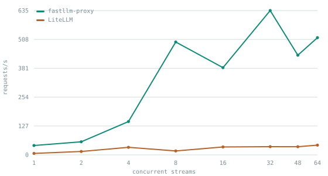
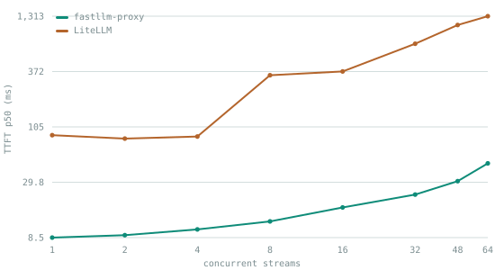
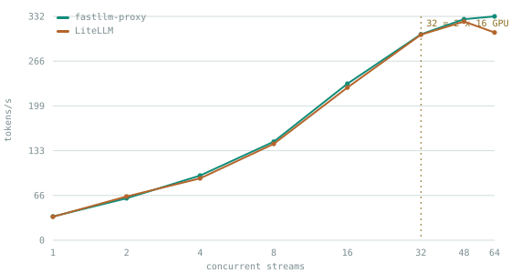
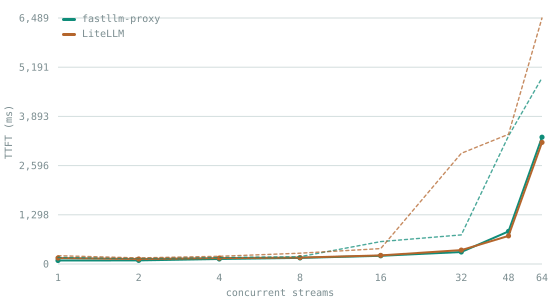

# fastllm-proxy

[](https://github.com/azrtydxb/Fastllm-proxy/actions/workflows/ci.yml)
[](LICENSE)

**The lowest-overhead LLM router.** Production-ready, highly available, and one OpenAI-compatible endpoint in front of everything you serve — written in Rust.

It fronts any number of inference backends (vLLM, SGLang, llama.cpp, or any of [80 providers](docs/providers.md)) behind one address: **0.76 µs of work per request**, no I/O on the request path, and response bodies that are never parsed. It reads LiteLLM-format config files unchanged, so it drops into an existing setup without rewriting anything.

## Quick start

```bash
git clone https://github.com/azrtydxb/Fastllm-proxy && cd Fastllm-proxy
docker compose up -d
docker compose exec fastllm fastllm-proxy set-password --name you --password 'change-me'
```

Clients point at `:4000`; the management UI is at `https://localhost:4001/`.
[Getting started](docs/getting-started.md) walks from here to a served request.

## Why it is fast, and stays fast

**No I/O on the request path.** RBAC, rate limits and budgets are integer comparisons against a snapshot flattened in memory. `tests/no_io_on_hot_path.rs` fails the build if that stops being true.

**No parsing on the response path.** Upstream frames reach the client exactly as they arrived. A gateway that deserialises each SSE chunk to re-emit it does thousands of parse/re-encode cycles per second per stream; this one does none, so the cost does not grow with how much your users read.

**Cache-affinity routing.** vLLM and SGLang keep a radix/prefix KV cache, so two requests sharing a system prompt are far cheaper on the _same_ node. Round-robin alternates them by construction — nodes look evenly loaded while aggregate throughput drops. A shared prefix goes back to the node already holding its cache, unless that node is meaningfully hotter than the least-loaded one.

**Highly available on purpose.** A proxy that loses its control plane keeps serving from its last snapshot. Failover is part of routing, health is tracked per replica and never merged, and `SIGHUP` swaps the routing table without dropping a stream.

## What it does

- **Cache-affinity routing** with a load escape hatch. A shared prefix goes back to the node that already has its KV cache, unless that node is meaningfully hotter than the least-loaded one.
- **Opaque response bodies.** Upstream frames reach the client exactly as they arrived — never deserialised, never re-encoded, never buffered.
- **Cache-affinity routing, frontend models, rule-based and semantic routing** — see below.
- **80 providers, and any OpenAI-compatible endpoint** — see below.
- **RBAC with real API keys.** Per-principal, per-model grants; keys hashed with SHA-256, passwords with Argon2id.
- **Rate limits, token budgets and usage accounting**, enforced without a database call on the request path.
- **Control plane / data plane split** by a runtime flag, so one image is a single container in a lab and a scaled deployment in Kubernetes.
- **Reloads in place.** `SIGHUP` or a snapshot poll swaps the routing table atomically; in-flight generations are unaffected.

It reads LiteLLM-format config files unchanged, so it drops into an existing setup without rewriting anything.

## Providers

**80 providers work today — 78 reached as-is, 2 through their own wire format — and adding one is a row in a table, not a code change and not a release.** Anything speaking the OpenAI API is already supported, whether or not it is on the list; the list exists so you do not have to go and find the base URL.

A caveat that list is explicit about, because the number is otherwise a boast: **"works" here means "is a configuration row that this proxy will forward to correctly"**, which follows from the endpoint being OpenAI-shaped. The ones exercised against real traffic in this repo's tests and on its dev cluster are marked ✓ there.

The named ones: **OpenRouter** ✓ (fronts ~400 models), OpenAI, Anthropic, Gemini, **Amazon Bedrock**, **Google Vertex AI**, **Azure OpenAI**, Groq, DeepSeek, xAI, Mistral, Together, Fireworks, Cohere, and self-hosted **vLLM** ✓, SGLang, **llama.cpp** ✓ and Ollama.

**→ [The full catalogue, how to add one, and how credentials are handled](docs/providers.md)**

Tool calling translates in both directions on native backends, streaming included, as do image and audio inputs. Native translation is opt-in per backend and byte-exact passthrough is preserved everywhere else — an `openai` backend's response is never parsed, which is where the latency numbers above come from.

## Routing

Two words, used consistently from here on:

|                    |                                                                                                                                |
| ------------------ | ------------------------------------------------------------------------------------------------------------------------------ |
| **Provider model** | What a request is routed _to_: one name on one provider. Two hosts serving the same model are two provider models                |
| **Frontend model** | What a client asks _for_: a name that resolves, by rules and weights, to a chain of provider models — and where two of them are balanced against each other |

A client can address either — a backend model resolves to itself. The admin
API still spells these `provider_models` and `frontend-models` in its paths, which is
what every existing script and the OpenAPI description use; the vocabulary
changed, the wire format did not.

A **frontend model** is a client-facing name with an ordered list of rules and a fallback chain. First rule whose conditions match wins; conditions within a rule are AND'd; targets are weighted _and_ ordered, so a rule is both a split and a failover chain.

Route on any of these:

| condition                                       | what it matches                                                                                                                                        |
| ----------------------------------------------- | ------------------------------------------------------------------------------------------------------------------------------------------------------ |
| `principals`, `roles`                           | who is calling                                                                                                                                         |
| `min/max_prompt_tokens`                         | how large the prompt is                                                                                                                                |
| `min/max_max_tokens`                            | how much generation was asked for                                                                                                                      |
| `stream`                                        | whether a human is waiting                                                                                                                             |
| `headers`                                       | exact header values — the client labels its own workload                                                                                               |
| _context window_                                | not a condition — a model whose declared `context_length` cannot hold the prompt plus the requested generation is automatically demoted down the chain |
| `min/max_budget_used_percent`                   | how much of the caller's budget is spent                                                                                                               |
| `max_inflight_per_backend`                      | how busy this rule's own targets are                                                                                                                   |
| `after`, `before`, `days`, `utc_offset_minutes` | wall-clock window, wrapping midnight                                                                                                                   |

```jsonc
// Local while the GPUs have room, cloud when they do not. No separate
// "spill" mechanism — first-match-wins does the work.
[{"position": 0, "max_inflight_per_backend": 2, "targets": ["local-qwen"]},
 {"position": 1,                                "targets": ["openrouter"]}]

// Batch work, labelled by the client, goes somewhere cheaper.
{"position": 0, "headers": {"x-fastllm-tier": "batch"}, "targets": ["cheap"]}

// Past 80% of budget, degrade to the free local model instead of 402-ing.
{"position": 0, "min_budget_used_percent": 80, "targets": ["local-qwen"]}
```

**One model catches everything.** `PUT /admin/fallback-model` names a deployment-wide last resort, appended to every chain — virtual or concrete — for the case a rule author did not anticipate. It is authorised like any other candidate, so it cannot widen anyone's access.

**Failover is part of routing, not a separate retry layer.** A rule's targets are tried in order on `5xx`, on `429`, and on an unreachable upstream — before any byte reaches the client. `429` counts because a hosted provider refusing a request is not the same as being unhealthy. Failover never widens reach: a candidate the caller lacks a grant on is dropped from the chain. Details in [docs/api.md](docs/api/routing-rules.md).

### Semantic routing

Route on **what a prompt is about**. A class is a name plus example prompts — no training step, no model to fine-tune, no labelled corpus. The control plane averages the examples into a centroid; the request path embeds the prompt and takes the nearest one.

```bash
curl -X POST https://control/admin/prompt-classes -b "$SESSION" \
  -d '{"name":"coding","examples":["Why does this Rust code fail the borrow checker?", "..."]}'
```

```jsonc
{ "position": 0, "class": "coding", "targets": ["claude-sonnet"] }
```

**Two tiers, and you only pay for the second when you ask for it.**

|         | model            | cost       | separates                                                                         |
| ------- | ---------------- | ---------- | --------------------------------------------------------------------------------- |
| fast    | static embedding | **115 µs** | subject matter — coding, maths, chat, legal, finance, security, databases, devops |
| refined | transformer      | 3.3 ms     | same subject, different intent — architecture vs. debugging                       |

The refined tier is gated on configuration, not a flag: if no rule names a class that needs it, the transformer is never loaded and no request can pay for it. Refined classes come in pairs — two of them refining the same fast class, because the question they answer is binary. When it is enabled, only requests the fast tier landed on a competing class escalate — under a tenth of traffic in practice, putting the average added cost near 0.2 ms.

Measured over ~21k human-labelled prompts, the fast tier reaches **82–98% precision** on twelve classes. Below a per-class confidence floor a rule simply does not match and the next rule catches the request, which is a routing decision rather than an error.

Two findings worth knowing before defining classes — **classify by subject, not by verb** (summarise / rewrite / extract fail on _both_ tiers), and check `POST /admin/prompt-classes/evaluate`, which reports which of your classes collide. Full per-class numbers and the benchmark harness: [docs/classifier.md](docs/classifier.md).

## How it compares

Measured 2026-08-07 against **LiteLLM** on an arm64 Kubernetes cluster. Both gateways: one replica, 4 CPU / 6 GiB, same idle node, reached over NodePort, same two vLLM backends, interleaved A/B runs. LiteLLM ran 4 uvicorn workers in `PRODUCTION` mode. Manifests: [bench/compare/](bench/compare/).

### With the GPU removed — what the gateway itself costs

A mock upstream that answers instantly, so the gateway is the only thing being measured.

<picture><source media="(prefers-color-scheme: dark)" srcset="docs/images/bench-mock-throughput-dark.svg"></picture> <picture><source media="(prefers-color-scheme: dark)" srcset="docs/images/bench-mock-latency-dark.svg"></picture>

**~15x the throughput and 10-28x lower latency**, and the gap widens with concurrency rather than narrowing. This is the ceiling on what the choice can be worth — you collect it only when the GPU is not your bottleneck.

### With real GPUs — throughput is a wash, consistency is not

Two vLLM replicas, 16 concurrent slots each. A gateway that balances correctly should climb to 32 concurrent streams and then flatten. Both do, and land on the same ceiling.

<picture><source media="(prefers-color-scheme: dark)" srcset="docs/images/bench-real-throughput-dark.svg"></picture> <picture><source media="(prefers-color-scheme: dark)" srcset="docs/images/bench-real-latency-dark.svg"></picture>

**Aggregate throughput is a wash** — both saturate the same GPUs, and at a single stream LiteLLM won several rounds outright. If your bottleneck is the GPU, the gateway barely moves your token rate.

What does differ is steadiness. At 32 streams, p99 time-to-first-token is **766 ms against 2921 ms**, and the gap between consecutive tokens is 15-25% less variable at _every_ concurrency level:

<picture><source media="(prefers-color-scheme: dark)" srcset="docs/images/bench-real-jitter-dark.svg"></picture>

A p50 that moves by 20 ms and one that moves by 280 ms are different products even when their medians match.

Full conditions, the per-request cost breakdown, the synthetic ceilings and what has _not_ been measured are in [docs/performance.md](docs/performance.md).

## Quickstart

Postgres and the gateway together, then a key, then a request:

```bash
docker compose up -d                       # proxy :4000, admin API :4001, postgres :5432

# The migrations seed a `bootstrap` service account. Give yourself a login,
# then mint a key against it.
docker compose exec fastllm fastllm-proxy set-password --name you --password 'change-me'
curl -sk -c /tmp/ck -X POST https://localhost:4001/login \
  -H 'content-type: application/json' -d '{"name":"you","password":"change-me"}'

curl -sk -b /tmp/ck -X POST https://localhost:4001/admin/provider-models \
  -H 'content-type: application/json' -d '{"name":"my-model"}'          # -> {"id":N}
curl -sk -b /tmp/ck -X POST https://localhost:4001/admin/provider-models/N/backends \
  -H 'content-type: application/json' \
  -d '{"api_base":"http://localhost:8000/v1","upstream_model":"Qwen/Qwen3-8B"}'
curl -sk -b /tmp/ck -X POST https://localhost:4001/admin/keys \
  -H 'content-type: application/json' -d '{"name":"first","principal_id":1}'
```

That last call returns the key once. Then it is an OpenAI endpoint:

```bash
curl http://localhost:4000/v1/chat/completions \
  -H "authorization: Bearer sk-..." -H 'content-type: application/json' \
  -d '{"model":"my-model","messages":[{"role":"user","content":"hi"}]}'
```

The management UI is on the same port as the admin API — open `https://localhost:4001/`
and the same login works.

### Already running LiteLLM?

Point the importer at your existing config and everything comes across —
models, backends, keys, and each key's per-model grants:

```bash
fastllm-proxy import --config litellm_config.yaml --database-url postgres://...
```

Idempotent, so it can be re-run; re-importing an edited file converges rather
than duplicating, and grants removed from the file are revoked. Your existing
keys keep working against the same models they already had. See
[docs/operations/configuration.md](docs/operations/configuration.md).

## Install

```bash
cargo build --release
# target/release/fastllm-proxy
```

## Documentation

**Read it as a site: [fastllm.azrty.com](https://fastllm.azrty.com/)** — same files, with search, diagrams and screenshots.

|                                                  |                                                                                                                |
| ------------------------------------------------ | -------------------------------------------------------------------------------------------------------------- |
| [Getting started](docs/getting-started.md)       | Install, first request, and a screenshot tour of every screen                                                  |
| [Performance](docs/performance.md)               | Every measured number, its conditions, and what has not been measured                                          |
| [What it can do](docs/features.md)               | The features, the measured trade-offs, and how a request finds a backend                                       |
| [Providers](docs/providers.md)                   | All 80, how to add one, and how upstream credentials are handled                                               |
| [MCP gateway](docs/mcp.md)                       | Tool servers behind one endpoint, namespaced and authorised                                                    |
| [A2A agents](docs/agents.md)                     | Agents behind one address, cards rewritten, versions pinned                                                    |
| [Connecting a client](docs/integrations.md)      | SDKs, coding agents, frameworks, and observability — copy-paste config for each                                |
| [Troubleshooting](docs/troubleshooting.md)       | The failures people actually hit, and what each one means                                                      |
| [Running it](docs/operations.md)                 | Five deployment shapes, from one binary to a scaled cluster, plus metrics, logs and traces                     |
| [Security](docs/security.md)                     | Trust boundaries, what is stored and in what form, and the one boundary to get right                           |
| [Command-line reference](docs/cli.md)            | Every flag and every subcommand                                                                                |
| [API and administration](docs/api.md)            | Endpoints, admin API, routing rules, auth, TLS, budgets, rate limits                                           |
| [Architecture](docs/architecture.md)             | Component and request-flow diagrams, failure modes, consistency guarantees                                     |
| [Semantic routing](docs/classifier.md)           | Classifier tiers: measured accuracy, cost, and configuring it in the UI                                        |
| [Changelog](CHANGELOG.md)                        | What changed, newest first                                                                                     |
| [Portable manifests](deploy/kubernetes/)         | `kubectl apply -k`, with TLS and LoadBalancer overlays                                                         |
| [Helm chart](charts/fastllm-proxy/)              | The same two Deployments, as values                                                                            |
| [Kubernetes operator](operator/)                 | A `FastllmProxy` resource: ordered upgrades, secret rotation, and a first admin login, reconciled continuously |
| [One real cluster's manifests](deploy/README.md) | Concrete values, applied continuously — a worked example, not a template                                       |
| [TODO](TODO.md)                                  | What is deliberately not built, and why                                                                        |

## Development

```bash
cargo test
cargo build --release
```

### Claude skills

`.claude/skills/` holds one skill per resource domain, covering every endpoint in
[`openapi.json`](openapi.json) plus two operational skills for running the
deployment and the inference backends behind it.

The endpoint table inside each skill is generated — `openapi.json` carries no
schemas, so request fields are read from the axum route table and the
`Deserialize` structs in `src/control/api.rs`. Everything outside the
`<!-- BEGIN GENERATED -->` markers is hand-written and preserved.

```bash
python3 scripts/gen-claude-skills.py          # regenerate
python3 scripts/gen-claude-skills.py --check  # fail if stale (runs in CI)
```

The check also fails when an endpoint belongs to no skill, so "every endpoint is
covered" is enforced by the build rather than asserted here.

## License

Apache-2.0
