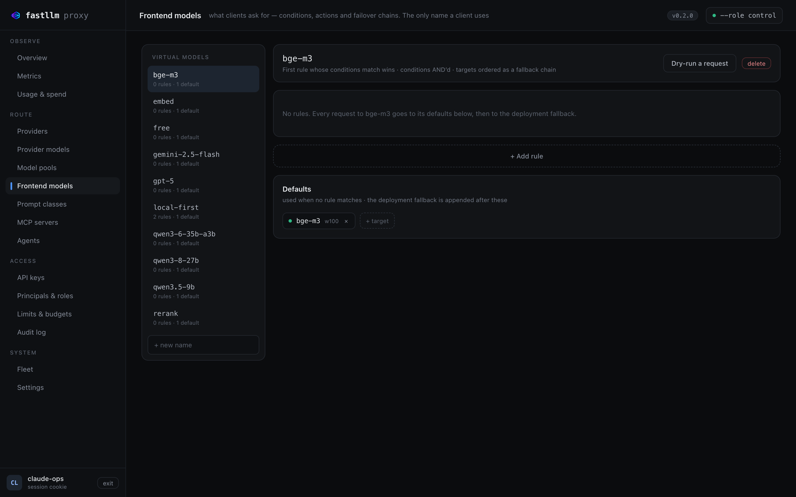

<div style="display: flex; align-items: center; gap: 10px; font-family: 'JetBrains Mono', monospace; font-size: 11.5px; letter-spacing: .12em; text-transform: uppercase; color: #687897; margin-bottom: 20px;">
  <span style="width: 22px; height: 1px; background: linear-gradient(90deg,#8b20ff,#00d9f5);"></span>
  Introduction
</div>

<h1 class="f-hero-title" style="margin: 0 0 18px; font-size: 54px; line-height: 1.02; font-weight: 800; letter-spacing: -.028em; text-wrap: balance;">The lowest-overhead<br /><span style="background: linear-gradient(90deg,#8b20ff 0%,#6726ff 22%,#1769ff 58%,#00d9f5 100%); -webkit-background-clip: text; background-clip: text; color: transparent;">LLM router.</span></h1>

<p style="margin: 0 0 30px; max-width: 660px; font-size: 17.5px; line-height: 1.6; color: var(--fg); opacity: .82; text-wrap: pretty;">One OpenAI-compatible endpoint in front of everything you serve. Written in Rust for teams putting real traffic through more than one model or node — <strong>0.76&nbsp;µs of work per request</strong>, and no I/O on the request path at all.</p>

<div style="display: flex; flex-wrap: wrap; align-items: center; gap: 12px; margin-bottom: 40px;">
  <a href="getting-started.html" style="display: inline-flex; align-items: center; height: 40px; padding: 0 20px; border-radius: 8px; background: linear-gradient(90deg,#8b20ff 0%,#6726ff 25%,#1769ff 60%,#00d9f5 100%); color: #030817; font-weight: 600; font-size: 14px; box-shadow: 0 0 26px rgba(23,105,255,.22);">Get started →</a>
  <a href="performance.html" style="display: inline-flex; align-items: center; height: 40px; padding: 0 18px; border-radius: 8px; background: #0d1b38; border: 1px solid #253a6b; color: #f8faff; font-weight: 500; font-size: 14px;">Performance</a>
  <a href="providers.html" style="display: inline-flex; align-items: center; height: 40px; padding: 0 18px; border-radius: 8px; border: 1px solid #253a6b; color: #aab7d1; font-weight: 500; font-size: 14px;">Providers</a>
</div>

<div class="f-flow" style="display: flex; align-items: center; gap: 0; padding: 22px 26px; border-radius: 14px; background: #071126; border: 1px solid #17254a; overflow: hidden; margin-bottom: 44px;">
  <div style="display: flex; flex-direction: column; gap: 11px; flex: none;">
    <div style="width: 130px; height: 2px; border-radius: 2px; background: linear-gradient(90deg, rgba(139,32,255,0), #8b20ff);"></div>
    <div style="width: 130px; height: 2px; border-radius: 2px; background: linear-gradient(90deg, rgba(103,38,255,0), #6726ff);"></div>
    <div style="width: 130px; height: 2px; border-radius: 2px; background: linear-gradient(90deg, rgba(23,105,255,0), #1769ff);"></div>
  </div>
  <div style="width: 44px; height: 50px; flex: none; margin: 0 18px; background: linear-gradient(160deg,#8b20ff,#1769ff 55%,#00d9f5); clip-path: polygon(50% 0%, 100% 25%, 100% 75%, 50% 100%, 0% 75%, 0% 25%); display: grid; place-items: center; box-shadow: 0 0 24px rgba(23,105,255,.28);">
    <div style="width: 30px; height: 34px; background: #071126; clip-path: polygon(50% 0%, 100% 25%, 100% 75%, 50% 100%, 0% 75%, 0% 25%); display: grid; place-items: center;">
      <div style="font-size: 15px; color: #00d9f5; line-height: 1;">→</div>
    </div>
  </div>
  <div style="flex: 1; height: 2px; border-radius: 2px; background: linear-gradient(90deg,#00d9f5, rgba(0,217,245,.05));"></div>
  <div style="flex: none; min-width: 0; display: flex; flex-direction: column; gap: 6px; padding-left: 18px; font-family: 'JetBrains Mono', monospace; font-size: 11.5px; color: #aab7d1; white-space: nowrap;">
    <div>openai/gpt-5 <span style="color: #687897;">· 38 ms</span></div>
    <div>anthropic/claude-sonnet <span style="color: #687897;">· 44 ms</span></div>
    <div>local/qwen-* <span style="color: #20d997;">· 21 ms</span></div>
  </div>
</div>

<div style="font-family: 'JetBrains Mono', monospace; font-size: 12px; color: #687897; margin-bottom: 10px;">Run it</div>
<div style="border-radius: 10px; border: 1px solid #17254a; background: #0a1530; overflow: hidden; margin-bottom: 44px;">
  <div style="display: flex; align-items: center; gap: 8px; padding: 9px 14px; border-bottom: 1px solid #17254a; background: #071126;">
    <span style="width: 7px; height: 8px; background: #8b20ff; clip-path: polygon(50% 0%, 100% 25%, 100% 75%, 50% 100%, 0% 75%, 0% 25%);"></span>
    <span style="font-family: 'JetBrains Mono', monospace; font-size: 11.5px; color: #687897;">bash</span>
  </div>
  <pre style="margin: 0; padding: 16px 18px; font-family: 'JetBrains Mono', monospace; font-size: 13.5px; line-height: 1.7; color: #f8faff; background: none; border: none; overflow-x: auto;"><span style="color: #00d9f5;">docker run</span> ghcr.io/azrtydxb/fastllm-proxy:<span style="color: #8b20ff;">v0.2.0</span> --help</pre>
</div>

<div class="f-metrics" style="display: grid; grid-template-columns: repeat(4, 1fr); gap: 14px; margin-bottom: 14px;">
  <div class="f-card" style="position: relative; padding: 18px 18px 16px; border-radius: 12px; background: #0a1530; border: 1px solid #17254a; overflow: hidden;">
    <div style="position: absolute; top: 0; left: 0; right: 0; height: 1px; background: linear-gradient(90deg, transparent, #8b20ff, transparent);"></div>
    <div style="font-size: 11px; font-weight: 600; letter-spacing: .07em; text-transform: uppercase; color: #687897;">Per-request work</div>
    <div style="font-family: 'JetBrains Mono', monospace; font-size: 27px; font-weight: 600; letter-spacing: -.02em; margin: 9px 0 5px; color: #f8faff;">0.76 µs</div>
    <div style="font-size: 12.5px; color: #aab7d1; line-height: 1.45;">No I/O on the request path</div>
  </div>
  <div class="f-card" style="position: relative; padding: 18px 18px 16px; border-radius: 12px; background: #0a1530; border: 1px solid #17254a; overflow: hidden;">
    <div style="position: absolute; top: 0; left: 0; right: 0; height: 1px; background: linear-gradient(90deg, transparent, #6726ff, transparent);"></div>
    <div style="font-size: 11px; font-weight: 600; letter-spacing: .07em; text-transform: uppercase; color: #687897;">Throughput vs LiteLLM</div>
    <div style="font-family: 'JetBrains Mono', monospace; font-size: 27px; font-weight: 600; letter-spacing: -.02em; margin: 9px 0 5px; color: #f8faff;">~15×</div>
    <div style="font-size: 12.5px; color: #aab7d1; line-height: 1.45;">Mock upstream, GPU removed</div>
  </div>
  <div class="f-card" style="position: relative; padding: 18px 18px 16px; border-radius: 12px; background: #0a1530; border: 1px solid #17254a; overflow: hidden;">
    <div style="position: absolute; top: 0; left: 0; right: 0; height: 1px; background: linear-gradient(90deg, transparent, #1769ff, transparent);"></div>
    <div style="font-size: 11px; font-weight: 600; letter-spacing: .07em; text-transform: uppercase; color: #687897;">p99 TTFT</div>
    <div style="font-family: 'JetBrains Mono', monospace; font-size: 27px; font-weight: 600; letter-spacing: -.02em; margin: 9px 0 5px; color: #f8faff;">766 ms</div>
    <div style="font-size: 12.5px; color: #aab7d1; line-height: 1.45;">Against 2921 ms at 32 streams</div>
  </div>
  <div class="f-card" style="position: relative; padding: 18px 18px 16px; border-radius: 12px; background: #0a1530; border: 1px solid #17254a; overflow: hidden;">
    <div style="position: absolute; top: 0; left: 0; right: 0; height: 1px; background: linear-gradient(90deg, transparent, #00d9f5, transparent);"></div>
    <div style="font-size: 11px; font-weight: 600; letter-spacing: .07em; text-transform: uppercase; color: #687897;">Screens in the binary</div>
    <div style="font-family: 'JetBrains Mono', monospace; font-size: 27px; font-weight: 600; letter-spacing: -.02em; margin: 9px 0 5px; color: #f8faff;">16</div>
    <div style="font-size: 12.5px; color: #aab7d1; line-height: 1.45;">Seventeen under the operator</div>
  </div>
</div>

## What it is

<div class="f-pillars" style="display: grid; grid-template-columns: 1fr 1fr; gap: 18px; margin-top: 26px;">
  <div class="f-card" style="padding: 22px; border-radius: 12px; background: #0a1530; border: 1px solid #17254a;">
    <div style="display: flex; align-items: center; gap: 11px; margin-bottom: 12px;">
      <div style="width: 22px; height: 25px; flex: none; background: #8b20ff; clip-path: polygon(50% 0%, 100% 25%, 100% 75%, 50% 100%, 0% 75%, 0% 25%); display: grid; place-items: center;"><div style="width: 12px; height: 14px; background: #0a1530; clip-path: polygon(50% 0%, 100% 25%, 100% 75%, 50% 100%, 0% 75%, 0% 25%);"></div></div>
      <div style="font-size: 16.5px; font-weight: 600; letter-spacing: -.01em; color: #f8faff;">Nothing on the path does I/O</div>
    </div>
    <p style="margin: 0; font-size: 14px; line-height: 1.62; color: #aab7d1; text-wrap: pretty;">RBAC, per-model grants, rate limits and budgets are integer comparisons against a snapshot already flattened in memory. A test in the repo fails the build if anything I/O-shaped lands there.</p>
  </div>
  <div class="f-card" style="padding: 22px; border-radius: 12px; background: #0a1530; border: 1px solid #17254a;">
    <div style="display: flex; align-items: center; gap: 11px; margin-bottom: 12px;">
      <div style="width: 22px; height: 25px; flex: none; background: #6726ff; clip-path: polygon(50% 0%, 100% 25%, 100% 75%, 50% 100%, 0% 75%, 0% 25%); display: grid; place-items: center;"><div style="width: 12px; height: 14px; background: #0a1530; clip-path: polygon(50% 0%, 100% 25%, 100% 75%, 50% 100%, 0% 75%, 0% 25%);"></div></div>
      <div style="font-size: 16.5px; font-weight: 600; letter-spacing: -.01em; color: #f8faff;">Nothing on the path parses</div>
    </div>
    <p style="margin: 0; font-size: 14px; line-height: 1.62; color: #aab7d1; text-wrap: pretty;">An upstream's frames reach your client exactly as they arrived — never deserialised, never re-encoded, never buffered. Cost does not grow with how much your users read.</p>
  </div>
  <div class="f-card" style="padding: 22px; border-radius: 12px; background: #0a1530; border: 1px solid #17254a;">
    <div style="display: flex; align-items: center; gap: 11px; margin-bottom: 12px;">
      <div style="width: 22px; height: 25px; flex: none; background: #1769ff; clip-path: polygon(50% 0%, 100% 25%, 100% 75%, 50% 100%, 0% 75%, 0% 25%); display: grid; place-items: center;"><div style="width: 12px; height: 14px; background: #0a1530; clip-path: polygon(50% 0%, 100% 25%, 100% 75%, 50% 100%, 0% 75%, 0% 25%);"></div></div>
      <div style="font-size: 16.5px; font-weight: 600; letter-spacing: -.01em; color: #f8faff;">Routing knows what your engine knows</div>
    </div>
    <p style="margin: 0; font-size: 14px; line-height: 1.62; color: #aab7d1; text-wrap: pretty;">A shared prefix goes back to the node already holding its KV cache, unless that node is meaningfully hotter than the least-loaded one. Round-robin makes every request pay full prefill.</p>
  </div>
  <div class="f-card" style="padding: 22px; border-radius: 12px; background: #0a1530; border: 1px solid #17254a;">
    <div style="display: flex; align-items: center; gap: 11px; margin-bottom: 12px;">
      <div style="width: 22px; height: 25px; flex: none; background: #00d9f5; clip-path: polygon(50% 0%, 100% 25%, 100% 75%, 50% 100%, 0% 75%, 0% 25%); display: grid; place-items: center;"><div style="width: 12px; height: 14px; background: #0a1530; clip-path: polygon(50% 0%, 100% 25%, 100% 75%, 50% 100%, 0% 75%, 0% 25%);"></div></div>
      <div style="font-size: 16.5px; font-weight: 600; letter-spacing: -.01em; color: #f8faff;">Highly available on purpose</div>
    </div>
    <p style="margin: 0; font-size: 14px; line-height: 1.62; color: #aab7d1; text-wrap: pretty;">A proxy that loses its control plane keeps serving from its last-known-good snapshot. Health is per replica, never merged, and SIGHUP swaps the routing table without touching in-flight generations.</p>
  </div>
</div>

## The numbers, and their conditions

Measured against LiteLLM on the same cluster, same backends, interleaved A/B
runs — with the GPU removed, so the gateway is the only thing being measured.

<div style="border-radius: 14px; border: 1px solid #17254a; background: #071126; padding: 26px 28px; margin: 24px 0;">
  <div style="display: flex; flex-direction: column; gap: 20px;">
    <div>
      <div style="display: flex; align-items: baseline; justify-content: space-between; margin-bottom: 9px;">
        <span style="font-size: 13.5px; color: #f8faff; font-weight: 500;">Requests per second</span>
        <span style="font-family: 'JetBrains Mono', monospace; font-size: 12px; color: #687897;">higher is better</span>
      </div>
      <div style="display: grid; grid-template-columns: 84px 1fr 96px; align-items: center; gap: 12px; margin-bottom: 7px;">
        <span style="font-size: 12.5px; color: #aab7d1;">fastllm</span>
        <div style="height: 9px; border-radius: 5px; background: #0a1530; overflow: hidden;"><div style="height: 100%; width: 100%; border-radius: 5px; background: linear-gradient(90deg,#1769ff,#00d9f5); box-shadow: 0 0 14px rgba(0,217,245,.35);"></div></div>
        <span style="font-family: 'JetBrains Mono', monospace; font-size: 13px; color: #00d9f5; text-align: right;">635/s</span>
      </div>
      <div style="display: grid; grid-template-columns: 84px 1fr 96px; align-items: center; gap: 12px;">
        <span style="font-size: 12.5px; color: #687897;">LiteLLM</span>
        <div style="height: 9px; border-radius: 5px; background: #0a1530; overflow: hidden;"><div style="height: 100%; width: 6%; border-radius: 5px; background: #253a6b;"></div></div>
        <span style="font-family: 'JetBrains Mono', monospace; font-size: 13px; color: #687897; text-align: right;">36/s</span>
      </div>
    </div>
    <div>
      <div style="display: flex; align-items: baseline; justify-content: space-between; margin-bottom: 9px;">
        <span style="font-size: 13.5px; color: #f8faff; font-weight: 500;">Median time to first token</span>
        <span style="font-family: 'JetBrains Mono', monospace; font-size: 12px; color: #687897;">lower is better</span>
      </div>
      <div style="display: grid; grid-template-columns: 84px 1fr 96px; align-items: center; gap: 12px; margin-bottom: 7px;">
        <span style="font-size: 12.5px; color: #aab7d1;">fastllm</span>
        <div style="height: 9px; border-radius: 5px; background: #0a1530; overflow: hidden;"><div style="height: 100%; width: 9%; border-radius: 5px; background: linear-gradient(90deg,#1769ff,#00d9f5); box-shadow: 0 0 14px rgba(0,217,245,.35);"></div></div>
        <span style="font-family: 'JetBrains Mono', monospace; font-size: 13px; color: #00d9f5; text-align: right;">8–46 ms</span>
      </div>
      <div style="display: grid; grid-template-columns: 84px 1fr 96px; align-items: center; gap: 12px;">
        <span style="font-size: 12.5px; color: #687897;">LiteLLM</span>
        <div style="height: 9px; border-radius: 5px; background: #0a1530; overflow: hidden;"><div style="height: 100%; width: 100%; border-radius: 5px; background: #253a6b;"></div></div>
        <span style="font-family: 'JetBrains Mono', monospace; font-size: 13px; color: #687897; text-align: right;">87–1313 ms</span>
      </div>
    </div>
    <div>
      <div style="display: flex; align-items: baseline; justify-content: space-between; margin-bottom: 9px;">
        <span style="font-size: 13.5px; color: #f8faff; font-weight: 500;">Inter-token jitter, real vLLM</span>
        <span style="font-family: 'JetBrains Mono', monospace; font-size: 12px; color: #687897;">std. deviation</span>
      </div>
      <div style="display: grid; grid-template-columns: 84px 1fr 96px; align-items: center; gap: 12px; margin-bottom: 7px;">
        <span style="font-size: 12.5px; color: #aab7d1;">fastllm</span>
        <div style="height: 9px; border-radius: 5px; background: #0a1530; overflow: hidden;"><div style="height: 100%; width: 76%; border-radius: 5px; background: linear-gradient(90deg,#1769ff,#00d9f5); box-shadow: 0 0 14px rgba(0,217,245,.35);"></div></div>
        <span style="font-family: 'JetBrains Mono', monospace; font-size: 13px; color: #00d9f5; text-align: right;">−15 to −25%</span>
      </div>
      <div style="display: grid; grid-template-columns: 84px 1fr 96px; align-items: center; gap: 12px;">
        <span style="font-size: 12.5px; color: #687897;">LiteLLM</span>
        <div style="height: 9px; border-radius: 5px; background: #0a1530; overflow: hidden;"><div style="height: 100%; width: 100%; border-radius: 5px; background: #253a6b;"></div></div>
        <span style="font-family: 'JetBrains Mono', monospace; font-size: 13px; color: #687897; text-align: right;">baseline</span>
      </div>
    </div>
  </div>
  <div style="margin-top: 24px; padding-top: 18px; border-top: 1px solid #17254a; display: flex; gap: 14px; align-items: flex-start;">
    <span style="flex: none; margin-top: 3px; width: 14px; height: 16px; background: #f5b942; clip-path: polygon(50% 0%, 100% 25%, 100% 75%, 50% 100%, 0% 75%, 0% 25%);"></span>
    <p style="margin: 0; font-size: 13.5px; line-height: 1.6; color: #aab7d1;">With real GPUs, aggregate throughput is a wash — both gateways saturate the same hardware. What survives contact with real silicon is steadiness: <strong style="color: #f8faff; font-weight: 600;">p99 TTFT of 766 ms against 2921 ms</strong> at 32 concurrent streams, and inter-token jitter 15–25% lower at every concurrency level.</p>
  </div>
</div>

[Every number, its conditions, and what was _not_ measured →](performance.md)

## What you get

<div style="margin-top: 24px; border-radius: 12px; border: 1px solid #17254a; overflow: hidden;">
  <div class="f-frow" style="display: grid; grid-template-columns: 250px 1fr; gap: 20px; padding: 14px 20px; border-bottom: 1px solid #17254a; background: #071126;"><div style="font-size: 14px; font-weight: 500; color: #f8faff;">Cache-affinity routing</div><div style="font-size: 13.5px; line-height: 1.6; color: #aab7d1;">A shared prefix returns to the node holding its KV cache. least-loaded, round-robin and lowest-latency are selectable.</div></div>
  <div class="f-frow" style="display: grid; grid-template-columns: 250px 1fr; gap: 20px; padding: 14px 20px; border-bottom: 1px solid #17254a; background: #071126;"><div style="font-size: 14px; font-weight: 500; color: #f8faff;">Frontend models</div><div style="font-size: 13.5px; line-height: 1.6; color: #aab7d1;">One client-facing name, ordered rules, weighted and ordered targets — so a rule is both a traffic split and a failover chain.</div></div>
  <div class="f-frow" style="display: grid; grid-template-columns: 250px 1fr; gap: 20px; padding: 14px 20px; border-bottom: 1px solid #17254a; background: #071126;"><div style="font-size: 14px; font-weight: 500; color: #f8faff;">Rule-based routing</div><div style="font-size: 13.5px; line-height: 1.6; color: #aab7d1;">Match on principal, role, prompt size, requested generation, streaming, headers, budget consumption, in-flight count or time of day.</div></div>
  <div class="f-frow" style="display: grid; grid-template-columns: 250px 1fr; gap: 20px; padding: 14px 20px; border-bottom: 1px solid #17254a; background: #071126;"><div style="font-size: 14px; font-weight: 500; color: #f8faff;">Semantic routing</div><div style="font-size: 13.5px; line-height: 1.6; color: #aab7d1;">A ~115 µs static-embedding tier decides most prompts; a transformer loads only if a rule asks for one.</div></div>
  <div class="f-frow" style="display: grid; grid-template-columns: 250px 1fr; gap: 20px; padding: 14px 20px; border-bottom: 1px solid #17254a; background: #071126;"><div style="font-size: 14px; font-weight: 500; color: #f8faff;">RBAC with real keys</div><div style="font-size: 13.5px; line-height: 1.6; color: #aab7d1;">Principals, roles, per-model grants. Keys SHA-256 hashed, passwords Argon2id — deliberately different.</div></div>
  <div class="f-frow" style="display: grid; grid-template-columns: 250px 1fr; gap: 20px; padding: 14px 20px; border-bottom: 1px solid #17254a; background: #071126;"><div style="font-size: 14px; font-weight: 500; color: #f8faff;">Usage accounting</div><div style="font-size: 13.5px; line-height: 1.6; color: #aab7d1;">Every attributable request, priced at the price in force when it ran, in integer micro-units.</div></div>
  <div class="f-frow" style="display: grid; grid-template-columns: 250px 1fr; gap: 20px; padding: 14px 20px; border-bottom: 1px solid #17254a; background: #071126;"><div style="font-size: 14px; font-weight: 500; color: #f8faff;">MCP and A2A gateways</div><div style="font-size: 13.5px; line-height: 1.6; color: #aab7d1;">Every tool server and agent behind one address, namespaced, with grants that are deliberately not implied by model:invoke.</div></div>
  <div class="f-frow" style="display: grid; grid-template-columns: 250px 1fr; gap: 20px; padding: 14px 20px; background: #071126;"><div style="font-size: 14px; font-weight: 500; color: #f8faff;">80 providers</div><div style="font-size: 13.5px; line-height: 1.6; color: #aab7d1;">Anything OpenAI-shaped is a row in a table. Anthropic and Gemini in their own wire format, translated both ways.</div></div>
</div>

[The full list, with its measured trade-offs and honest limits →](features.md)

## Routing you can inspect before you trust it

Dry-run answers which rule would decide and what the chain resolves to,
without dispatching anything — because a routing table you cannot interrogate
is a routing table you find out about in production.

<div style="border-radius: 14px; border: 1px solid #17254a; background: #0a1530; padding: 10px; box-shadow: 0 0 30px rgba(23,105,255,.07); margin: 22px 0;">
  
</div>

## History, not just a live view

Requests stacked as served / upstream errors / refusals-by-kind — because a
caller stopped by a budget and a backend that fell over need different people
to do different things. A gap in the latency line is a bucket with nothing to
measure, never zero.

<div style="border-radius: 14px; border: 1px solid #17254a; background: #0a1530; padding: 10px; box-shadow: 0 0 30px rgba(23,105,255,.07); margin: 22px 0;">
  
</div>

## Already running LiteLLM?

```bash
fastllm-proxy import --config litellm_config.yaml --database-url postgres://...
```

Models, backends, keys and each key's per-model grants come across. Idempotent
— re-importing an edited file converges rather than duplicating, and grants
removed from the file are revoked. Your existing keys keep working against the
same models they already had.

## Start here

<div class="f-starts" style="display: grid; grid-template-columns: repeat(3, 1fr); gap: 14px; margin-top: 24px;">
  <a class="f-start" href="getting-started.html" style="display: block; padding: 17px 18px; border-radius: 12px; background: #0a1530; border: 1px solid #17254a;">
    <div style="display: flex; align-items: center; gap: 8px; font-size: 14.5px; font-weight: 600; color: #f8faff; margin-bottom: 7px;">Getting started <span style="color: #1769ff;">→</span></div>
    <div style="font-size: 13px; line-height: 1.55; color: #687897;">Install, first request, and a tour of every screen</div>
  </a>
  <a class="f-start" href="performance.html" style="display: block; padding: 17px 18px; border-radius: 12px; background: #0a1530; border: 1px solid #17254a;">
    <div style="display: flex; align-items: center; gap: 8px; font-size: 14.5px; font-weight: 600; color: #f8faff; margin-bottom: 7px;">Performance <span style="color: #1769ff;">→</span></div>
    <div style="font-size: 13px; line-height: 1.55; color: #687897;">Every number, its conditions, and what was not measured</div>
  </a>
  <a class="f-start" href="providers.html" style="display: block; padding: 17px 18px; border-radius: 12px; background: #0a1530; border: 1px solid #17254a;">
    <div style="display: flex; align-items: center; gap: 8px; font-size: 14.5px; font-weight: 600; color: #f8faff; margin-bottom: 7px;">Providers <span style="color: #1769ff;">→</span></div>
    <div style="font-size: 13px; line-height: 1.55; color: #687897;">All 80, how to add one, how credentials are handled</div>
  </a>
  <a class="f-start" href="integrations.html" style="display: block; padding: 17px 18px; border-radius: 12px; background: #0a1530; border: 1px solid #17254a;">
    <div style="display: flex; align-items: center; gap: 8px; font-size: 14.5px; font-weight: 600; color: #f8faff; margin-bottom: 7px;">Connecting a client <span style="color: #1769ff;">→</span></div>
    <div style="font-size: 13px; line-height: 1.55; color: #687897;">OpenAI SDKs, five coding agents, four frameworks</div>
  </a>
  <a class="f-start" href="operations.html" style="display: block; padding: 17px 18px; border-radius: 12px; background: #0a1530; border: 1px solid #17254a;">
    <div style="display: flex; align-items: center; gap: 8px; font-size: 14.5px; font-weight: 600; color: #f8faff; margin-bottom: 7px;">Operations <span style="color: #1769ff;">→</span></div>
    <div style="font-size: 13px; line-height: 1.55; color: #687897;">Five deployment shapes, from one binary to a cluster</div>
  </a>
  <a class="f-start" href="architecture.html" style="display: block; padding: 17px 18px; border-radius: 12px; background: #0a1530; border: 1px solid #17254a;">
    <div style="display: flex; align-items: center; gap: 8px; font-size: 14.5px; font-weight: 600; color: #f8faff; margin-bottom: 7px;">Architecture <span style="color: #1769ff;">→</span></div>
    <div style="font-size: 13px; line-height: 1.55; color: #687897;">How the pieces fit, and how they fail</div>
  </a>
</div>

Deploying to Kubernetes: the [Helm chart](https://github.com/azrtydxb/Fastllm-proxy/tree/main/charts/fastllm-proxy),
or the [worked manifests](https://github.com/azrtydxb/Fastllm-proxy/tree/main/deploy)
for one real cluster. Everything else — troubleshooting, security, the CLI,
the API, the changelog — is in the sidebar.

<div style="margin-top: 40px; padding-top: 20px; border-top: 1px solid #17254a; display: flex; align-items: center; gap: 16px; font-size: 13px; color: #687897; font-family: 'JetBrains Mono', monospace;">
  <span>Apache-2.0</span>
  <span style="width: 4px; height: 5px; background: #253a6b; clip-path: polygon(50% 0%, 100% 25%, 100% 75%, 50% 100%, 0% 75%, 0% 25%);"></span>
  <a href="https://github.com/azrtydxb/Fastllm-proxy">source</a>
  <span style="width: 4px; height: 5px; background: #253a6b; clip-path: polygon(50% 0%, 100% 25%, 100% 75%, 50% 100%, 0% 75%, 0% 25%);"></span>
  <a href="https://github.com/azrtydxb/Fastllm-proxy/releases/tag/v0.2.0">v0.2.0</a>
</div>
