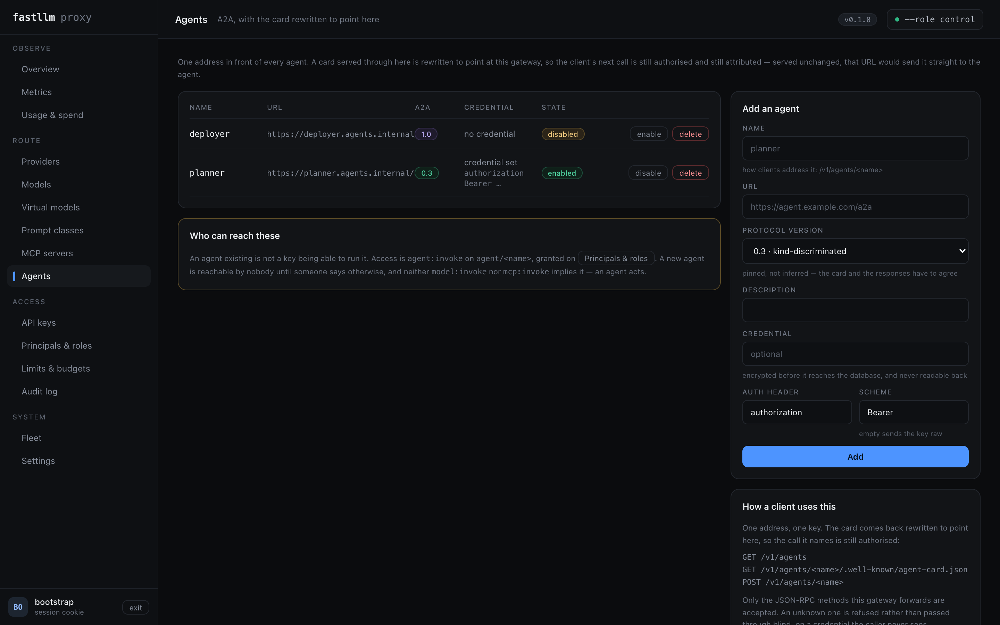

# A2A agents

**One address in front of every agent.** The same argument as the
[MCP gateway](mcp.md), one step further out: an agent *acts* — it runs, it
calls tools, it spends money — so "which of our keys may set which agent
running" is a question somebody eventually has to answer.



Add one on **Agents**, or by API:

```bash
curl -sk -b /tmp/ck -X POST https://control:4001/admin/a2a-agents \
  -H 'content-type: application/json' -d '{
    "name": "planner",
    "url": "https://planner.agents.internal/a2a",
    "protocol_version": "0.3",
    "upstream_api_key": "..."
  }'
```

| field | |
|---|---|
| `name` | Addressed as `/v1/agents/<name>` |
| `url` | The agent's A2A endpoint |
| `protocol_version` | `0.3` or `1.0`, **pinned** — see below |
| `auth_header` / `auth_scheme` | As for any upstream; `""` sends the credential raw |
| `upstream_api_key` | Encrypted at rest, never readable back |

## Calling one

```bash
# What this key may run.
curl -H "authorization: Bearer sk-..." http://gateway:4000/v1/agents

# The card — rewritten to point here.
curl -H "authorization: Bearer sk-..." \
  http://gateway:4000/v1/agents/planner/.well-known/agent-card.json

# Every JSON-RPC method, on one path.
curl -XPOST http://gateway:4000/v1/agents/planner \
  -H "authorization: Bearer sk-..." -H 'content-type: application/json' \
  -d '{"jsonrpc":"2.0","id":1,"method":"message/send",
       "params":{"message":{"role":"user","parts":[{"kind":"text","text":"plan it"}]}}}'
```

### The card is rewritten, and that is the point

A client fetches an agent card and then talks to whatever `url` it names.
Served unchanged, that URL is *the agent* — so the client's next request goes
straight past the key check and the spend attribution, and this becomes a
discovery service rather than a gateway.

The card served here names this gateway, and carries the agent's pinned
`protocolVersion` rather than whatever the upstream claimed. Everything else
in the card is passed through untouched.

The gateway's address is taken from the request's `Host` rather than
configured: a deployment sits behind a Service, a VIP, an Ingress and a
port-forward at different times, and one configured base URL is wrong for
three of those.

### Versions are pinned, never inferred

A2A 0.3 discriminates objects by `kind`. 1.0 uses protobuf JSON envelopes with
PascalCase method names. A gateway *can* infer which one a client wants from
the method it called, and LiteLLM does — but an inference means the agent card
can say one thing while the response is the other, and a client that has
already branched on the card is then wrong in a way that looks like the agent
misbehaving.

So the version is a column. **This gateway forwards; it does not translate
between versions.** If your agent speaks 0.3 and your client wants 1.0, that
is a translator, and it is not written. Stating that is the point — a gateway
that silently half-does it is worse than one that does not.

### Only known methods are forwarded

| 0.3 | 1.0 |
|---|---|
| `message/send`, `message/stream` | `SendMessage`, `SendStreamingMessage` |
| `tasks/get`, `tasks/list`, `tasks/cancel`, `tasks/resubscribe` | `GetTask`, `ListTasks`, `CancelTask`, `TaskSubscription` |
| `agent/getAuthenticatedExtendedCard` | `GetAgentCard` |

Anything else is a `400`. An unknown method forwarded blind is a request whose
effects nobody here can describe, made with a credential the caller never
sees. Adding one is a line of code, once somebody can say what it does.

`message/stream` is forwarded without being buffered, the same as a completion
— inspecting it would defeat streaming for exactly the same reason.

## Access

```bash
curl -sk -b /tmp/ck -X POST https://control:4001/admin/roles/agents/permissions \
  -H 'content-type: application/json' -d '{"verb":"agent:invoke","resource":"agent/planner"}'
```

`agent/*` for every agent. **Neither `model:invoke` nor `mcp:invoke` implies
it** — an agent acts, and being allowed to call a model or read a tool server
says nothing about that. The seeded `inference` role does not get it; only
`admin` does.

An agent the caller may not reach answers `404`, exactly as one that does not
exist.

## Where next

| | |
|---|---|
| [MCP gateway](mcp.md) | The same idea for tool servers |
| [Security](security.md) | Where the credential lives, and what `/snapshot` carries |
| [Interactive API reference](api/swagger.md) | The three routes and their responses |
