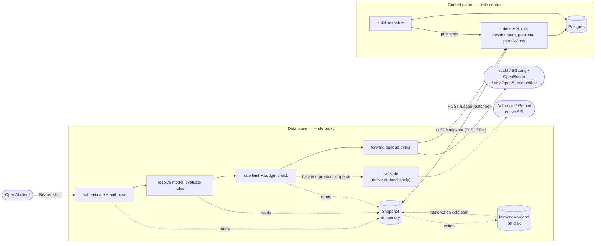
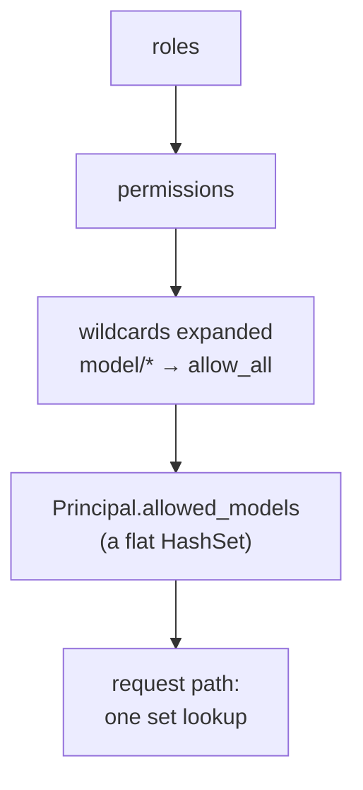
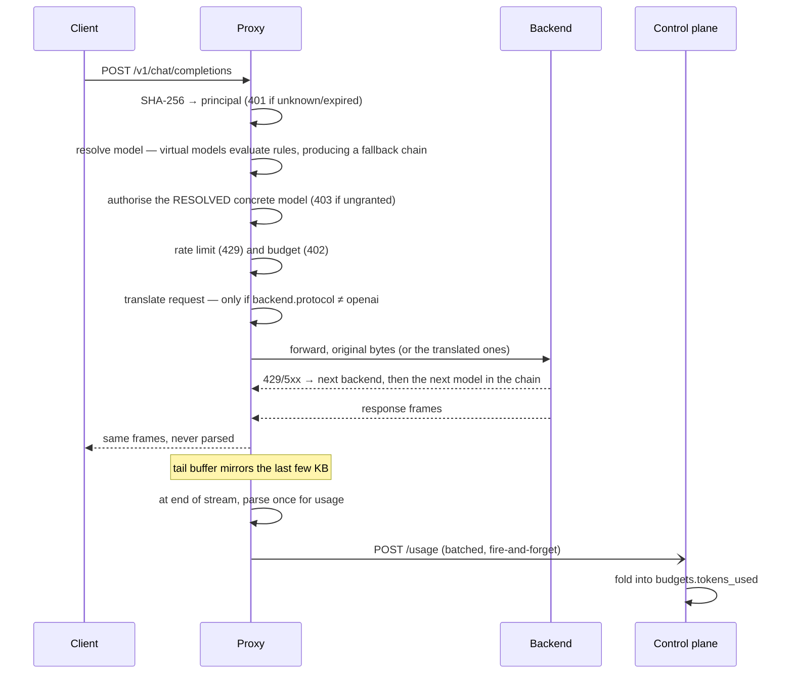

# Architecture

Keep this current. Per `CLAUDE.md`, a change that adds a component, a role, an
endpoint crossing a plane boundary, or alters how the snapshot moves makes
these diagrams wrong, and redrawing them is part of that change's commit.

## The two planes

One binary, three roles. The split between management and forwarding is a
runtime flag, not a deployment boundary, so the same image is a single
container in a lab and a scaled deployment in Kubernetes.

`--role all` runs both boxes in one process; the snapshot is handed over in
memory instead of over HTTP, and the rate-limit reconciliation machinery is
inert because one process's counters are already global.

## Why a snapshot, and why it is pre-flattened

The request path must do no I/O — the proxy's measured overhead against a real
vLLM is zero, and a database round trip per request would cost more than the
proxying itself. So every expensive question is answered once, when the
snapshot is built, never per request:

Per request that leaves: one SHA-256 of the bearer token, one hash lookup to a
principal, an expiry comparison, one set lookup for the model, and — when the
principal has a limit — an `RwLock` read plus up to two short mutex-guarded
bucket operations. No graph walk, no I/O, no lock held across an await, no
allocation beyond what the body already needed.

## Two execution modes

The dotted branch above is the whole of multi-provider support, and it is
drawn dotted on purpose: it is not on the default path.

| | passthrough (`protocol = openai`) | translated (`anthropic`, `gemini`) |
|---|---|---|
| request body | forwarded as-is, or one splice for a model alias | parsed and re-serialised into the native shape |
| response body | never parsed; forwarded byte for byte | parsed, re-framed into OpenAI chunks |
| usage | bounded tail buffer, one parse at end of stream | already parsed, exactly, during translation |
| endpoints | all seven proxied suffixes | `/chat/completions` only; the rest are `501` |
| overhead | zero measured against a real vLLM | one parse per frame |

Most providers are the left column, including OpenRouter — which is why
"support every provider `genai` supports" is mostly a configuration exercise
and not a code one. Only Anthropic and Gemini, addressed directly rather than
through an OpenAI-compatible gateway, are the right column.

The boundary is enforced, not merely intended: `tests/native_protocols.rs`
sends an intentionally odd-but-valid JSON document (unusual whitespace, key
order no serializer of ours would emit, a field we have no struct for) through
an `openai` backend and asserts the client receives those exact bytes. Any
accidental round trip through a parse shows up as a diff.

## A request, end to end

Two decisions in that flow are load-bearing:

- **Authorisation is checked against the resolved concrete model**, never the
  virtual name. A virtual model routes access; it must never grant it, or a
  rule edit or a weighted split could hand a caller a model they were never
  granted. With a fallback chain this becomes a filter: ungranted candidates
  are dropped from the chain, so failover only ever moves to a model the caller
  already had. The "served here" check runs *before* it, so an unknown model is
  a 404 for everyone and 403-vs-404 cannot be used to probe what exists.
- **Usage is read from a fixed-size tail buffer, parsed once at the end** —
  never per frame. The response is still forwarded as opaque bytes. A
  translated response is the exception in the cheaper direction: its token
  counts were already parsed exactly, so it carries no tail buffer at all.

## Administrative permissions

Admin routes are gated by a session *and* a per-route permission, drawn from
the same `roles → permissions` model the inference side uses: `usage:read` for
reads, `key:create` and `key:revoke` for key lifecycle, `config:write` for
everything else.

Two things an operator should know rather than discover:

- `config:write` is effectively administrative. A principal holding it can
  grant itself roles through `POST /admin/principals/{id}/roles`, so
  `key:create`/`key:revoke` are a separation of *duties*, not a security
  boundary against it.
- The `/admin/*` 404 for an unknown path is served outside the session gate,
  so an anonymous caller can tell which admin paths are not routes. It
  discloses no data, only the shape of the API.

## Failure modes

| event | behaviour |
|---|---|
| control plane down, proxy warm | serves from memory; policy stops changing |
| control plane down, proxy cold | loads last-known-good from disk |
| cold start, no cache | starts, `/health` unhealthy, never crash-loops |
| snapshot invalid | keeps the previous one, logs once |
| key revoked | effective within the poll interval, ~1s |
| a model in a chain returns 429/5xx | the next model in the same rule serves it; nothing reached the client yet |
| every model in the chain refuses | the last upstream's own status and body are forwarded, not a synthetic 502 |
| Postgres down | control plane serves its last built snapshot; proxies unaffected |
| usage report fails | dropped; never blocks a request |
| upstream speaks an unexpected shape | translated backends only: the body fails rather than returning a plausible empty completion |
| snapshot names an unknown protocol | that backend is dropped with a logged reason, never silently treated as OpenAI |

Never crash-looping on a cold start is deliberate: under Kubernetes that would
turn a control-plane outage into a data-plane outage, which is the failure this
split exists to prevent.

## Consistency, stated honestly

- **Budgets are enforced after the fact.** A request that blows the budget
  completes; the next is refused. Counting mid-stream would mean parsing every
  frame.
- **Rate limits can overshoot by up to one reconciliation window** during a
  sharp spike, because replicas enforce locally and reconcile periodically
  rather than sharing a counter on the request path.
- **A replica with no recent traffic for a principal keeps a floor of
  `1/replicas` of that principal's limit.** Without it an idle replica's
  computed share collapses to zero and it refuses every request while the
  principal is far under budget — a worse failure than over-admitting. The
  floor bounds total allocation at under 2x the configured limit in the worst
  case (one busy replica, the rest idle), never more.
- **Policy changes propagate within one snapshot poll**, not instantly.
- **Two routing conditions are deliberately non-deterministic.**
  `max_inflight_per_backend` reads live in-flight counters and the time-window
  conditions read the clock, so identical requests can route differently and
  prefix affinity stops applying to the traffic they divert. Every other
  condition is a pure function of the request. This is the same
  opt-in-visibly line the passthrough/translate split draws.

## Behaviour notes

- **Retries** only happen before any byte has been forwarded. Once the response is committed a mid-stream failure propagates as-is — it cannot be silently retried without corrupting the stream.
- **5xx is retried, 4xx is not.** A client error retried across every node is the same client error three times.
- **The last backend's response is forwarded verbatim.** A 5xx is only retried while another backend remains; when none does, the upstream's own status and body reach the client rather than a synthetic 502. On a single-node pool that means every error keeps the engine's diagnostics.
- **Audio endpoints take `multipart/form-data`.** `model` is read from the form field and the upload is forwarded byte for byte, content-type and boundary intact. An alias splices the new name into that one field rather than re-encoding the body.
- **`https://` backends work**, so a TLS-terminated or hosted endpoint can sit in the same config as cluster-local nodes. System root certificates are used, falling back to the bundled Mozilla set.
- **A backend that fails every probe is still used as a last resort** rather than returning 503. A stale health flag should not turn a recoverable request into an outage.
- **The client's `Authorization` header is never forwarded.** It authenticates the client to the proxy; the upstream gets the backend's own key or none — in whichever header that provider reads it from.
- **An OpenAI-compatible backend's response is never parsed.** Bytes are forwarded verbatim, which is why proxied overhead measures at zero; `tests/native_protocols.rs` pins it against an intentionally odd-but-valid payload. Only a backend explicitly configured for a native protocol is translated, and only there is a response body read.
- **A backend's identity covers its whole configuration.** Rotating an upstream key, or changing a backend's protocol, produces a new routing entry rather than reusing the live one — otherwise a reload would keep serving with the old credential, since backend objects are carried across reloads to preserve their in-flight counts.
- **Affinity keys hash the raw request prefix**, not parsed fields. JSON does not guarantee field order, but order is stable per client, which is all affinity needs — a client that reorders per request degrades to least-loaded rather than misrouting.
- **A rate-limited request gets `429` with `Retry-After`**, checked after authorisation and model resolution but before the request is dispatched upstream — nothing is forwarded on a rejected request. See "Rate limits" above.
