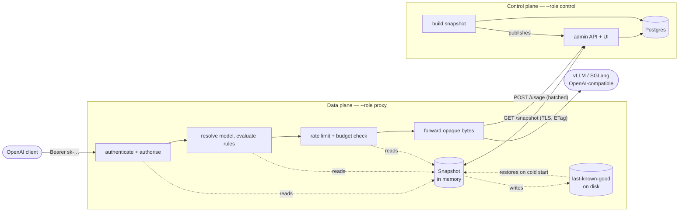
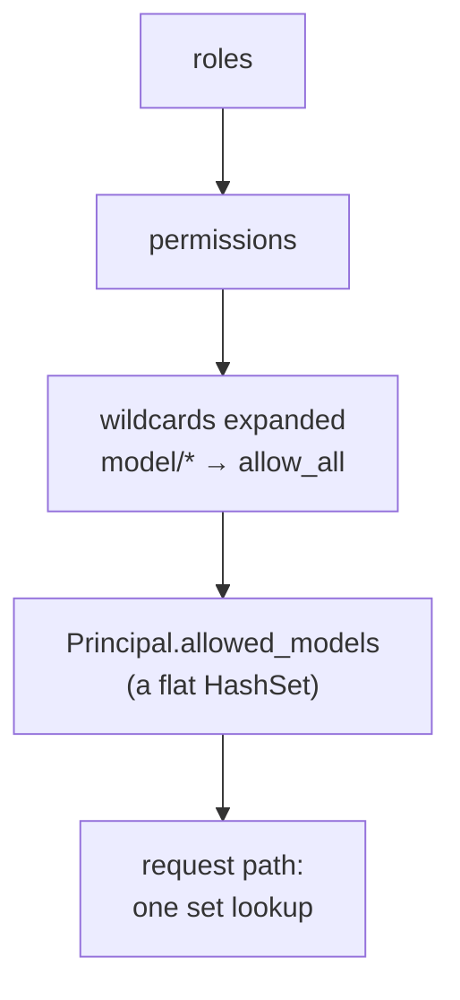
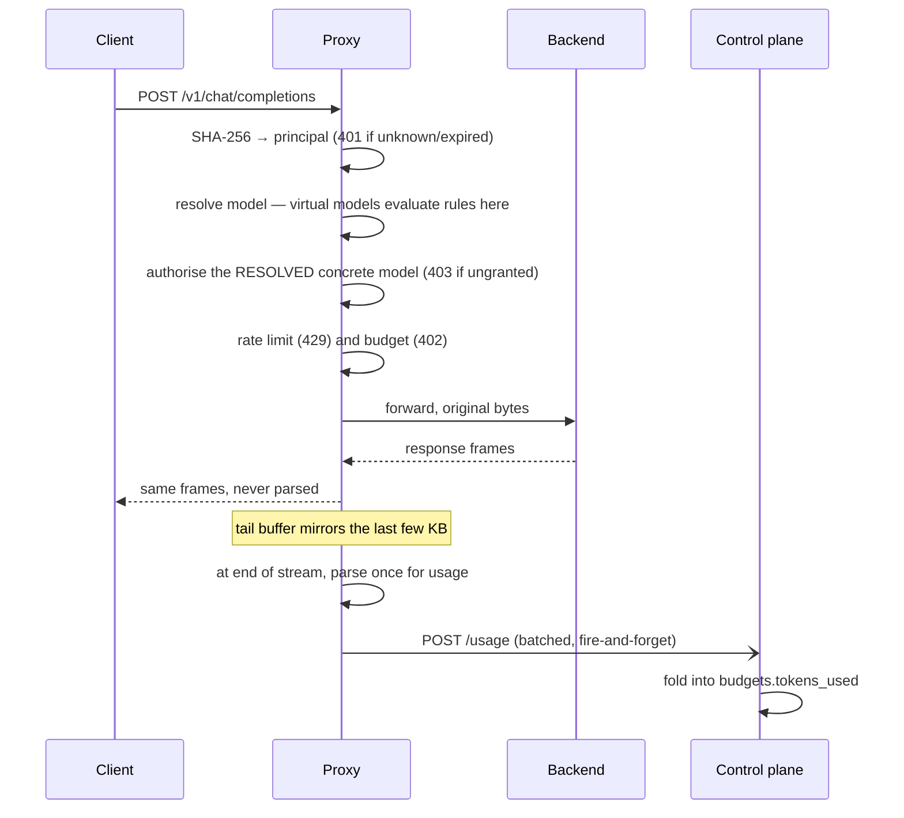

# Architecture

Keep this current. Per `CLAUDE.md`, a change that adds a component, a role, an
endpoint crossing a plane boundary, or alters how the snapshot moves makes
these diagrams wrong, and redrawing them is part of that change's commit.

## The two planes

One binary, three roles. The split between management and forwarding is a
runtime flag, not a deployment boundary, so the same image is a single
container in a lab and a scaled deployment in Kubernetes.

`--role all` runs both boxes in one process; the snapshot is handed over in
memory instead of over HTTP, and the rate-limit reconciliation machinery is
inert because one process's counters are already global.

## Why a snapshot, and why it is pre-flattened

The request path must do no I/O — the proxy's measured overhead against a real
vLLM is zero, and a database round trip per request would cost more than the
proxying itself. So every expensive question is answered once, when the
snapshot is built, never per request:

Per request that leaves: one SHA-256 of the bearer token, one hash lookup to a
principal, an expiry comparison, one set lookup for the model, one atomic
decrement for the rate limit. No graph walk, no lock held across an await, no
allocation beyond what the body already needed.

## A request, end to end

Two decisions in that flow are load-bearing:

- **Authorisation is checked against the resolved concrete model**, never the
  virtual name. A virtual model routes access; it must never grant it, or a
  rule edit or a weighted split could hand a caller a model they were never
  granted.
- **Usage is read from a fixed-size tail buffer, parsed once at the end** —
  never per frame. The response is still forwarded as opaque bytes.

## Failure modes

| event | behaviour |
|---|---|
| control plane down, proxy warm | serves from memory; policy stops changing |
| control plane down, proxy cold | loads last-known-good from disk |
| cold start, no cache | starts, `/health` unhealthy, never crash-loops |
| snapshot invalid | keeps the previous one, logs once |
| key revoked | effective within the poll interval, ~1s |
| Postgres down | control plane serves its last built snapshot; proxies unaffected |
| usage report fails | dropped; never blocks a request |

Never crash-looping on a cold start is deliberate: under Kubernetes that would
turn a control-plane outage into a data-plane outage, which is the failure this
split exists to prevent.

## Consistency, stated honestly

- **Budgets are enforced after the fact.** A request that blows the budget
  completes; the next is refused. Counting mid-stream would mean parsing every
  frame.
- **Rate limits can overshoot by up to one reconciliation window** during a
  sharp spike, because replicas enforce locally and reconcile periodically
  rather than sharing a counter on the request path.
- **Policy changes propagate within one snapshot poll**, not instantly.
