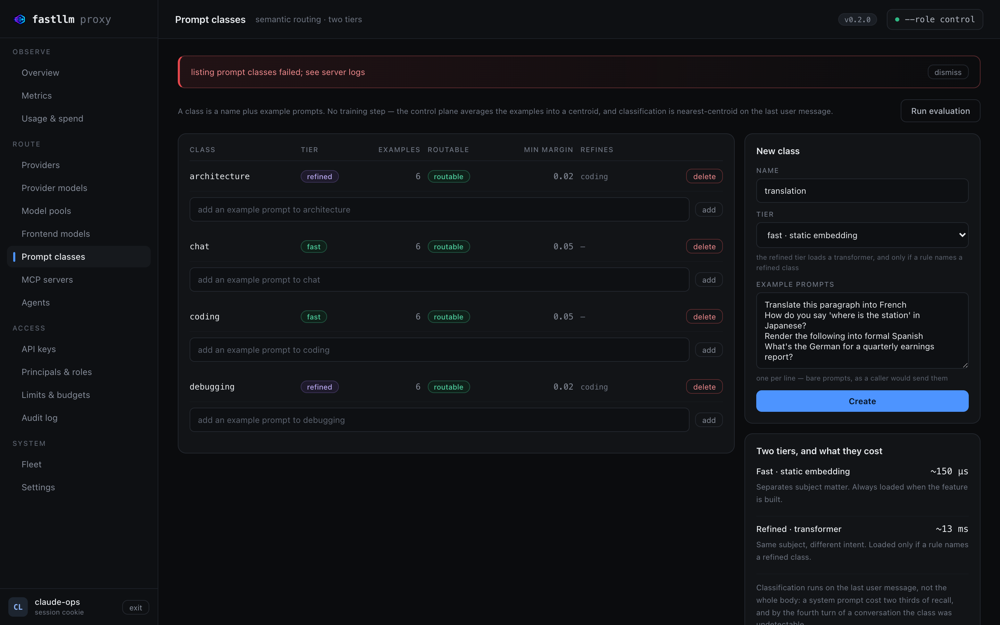
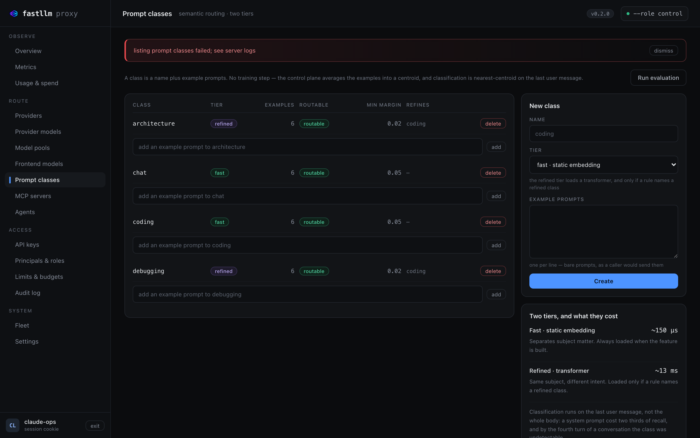
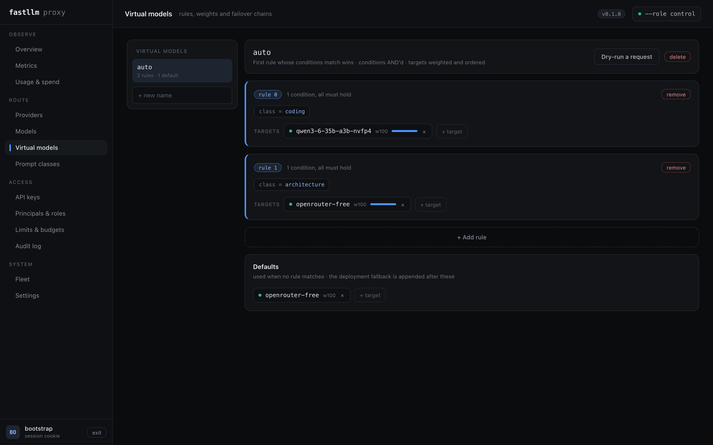

# Setting up semantic routing

Define a class, check it separates, then name it in a rule.

**Status: shipped**, behind the `classifier` cargo feature and a
`--classifier-model` pointing at the model — the Docker image bakes one in and
sets it, so it works out of the box there.

Define a class with example prompts, then name it in a routing rule:

```bash
curl -X POST https://control/admin/prompt-classes -b "$SESSION" \
  -H 'content-type: application/json' \
  -d '{"name":"coding","min_margin":0.05,
       "examples":["Why does this Rust code fail the borrow checker?",
                   "My unit test throws NullPointerException on line 42."]}'
```
```jsonc
{"position": 0, "class": "coding", "targets": ["claude-sonnet"]}
```

`POST /admin/prompt-classes/evaluate` reports, per class, leave-one-out
precision and recall over your own examples, the mean and worst margin, the
nearest other classes, the examples that were misclassified, and a verdict.
Two classes whose centroids sit above ~0.8 are one region with two names and no
threshold separates them — the report says so rather than leaving you to infer
it from four numbers.

## Setting it up in the UI

Everything above is a screen, and **Prompt classes** is where a class begins.
A name, a tier, and example prompts one per line — no training step and no
model to fit. Create it, and the control plane averages the examples into a
centroid on its next rebuild.



The **tier** selector is the decision worth pausing on, and the panel beside
the form states its price: `fast` costs ~150 µs and is always loaded; `refined`
costs ~13 ms and loads a transformer, but only if some rule actually names a
refined class. Choose `fast` unless you need to separate two things that share
a subject — `debugging` from `coding`, say — which is exactly what the refined
tier is for.

The table's **routable** column is the one that saves an afternoon. A class
with examples but no centroid cannot match, so a rule naming it silently never
fires — which looks identical to a rule that is simply not being hit. The
screen calls it out rather than leaving you to infer it.

### Check the classes before you route on them

**Run evaluation** scores every example against centroids that *exclude* it:



Per class: precision, recall, the nearest other class with its similarity, and
a verdict. Read the **nearest** column first. Two classes sitting above ~0.8
are one region with two names, and no threshold you pick will separate them —
the fix is different examples, not a different margin. Above, `architecture`
and `debugging` sit at 0.74 and still separate cleanly, because both are
refined classes doing exactly the job the refined tier exists for.

Overall accuracy is deliberately not the headline. A class that is a small
share of your traffic can fail completely while accuracy barely moves — the
base-rate trap that once hid a total classifier failure in this codebase.

### Then name the class in a rule



On **Virtual models**, a rule's condition can be a prompt class, and its
targets are weighted and ordered. **Dry-run** answers which rule a given
prompt would hit and what the chain resolves to, without dispatching
anything — which is how you confirm the classifier and the rule agree before
real traffic depends on it.

## Where next

The measurements behind every choice above — which classes separate, what each
tier costs in production, and what is deliberately not built — are in
[what the classifier actually costs](measurements.md).
