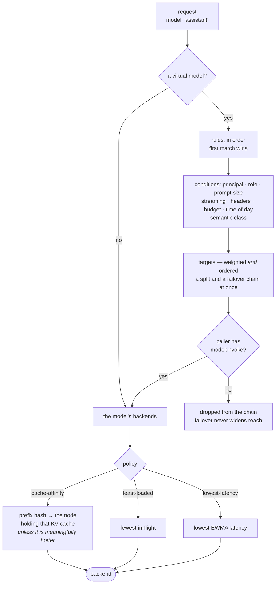

# What it can do

The lowest-overhead router in front of everything you serve: chat, images,
speech, embeddings and reranking through one endpoint, with routing that keeps
your KV cache warm and accounting that costs the request path nothing.

What follows is what it does and what that is worth measured — including the
places the measurements are less flattering, because you cannot plan a
deployment from numbers that only ever point one way.

## Where the low overhead comes from

Three properties, and each is structural rather than a setting you tune.

**No I/O on the request path.** RBAC, per-model grants, rate limits and
budgets resolve to integer comparisons against a snapshot already flattened in
memory. `tests/no_io_on_hot_path.rs` fails the build if anything I/O-shaped
lands there, which is what keeps it true after the fact.

**No parsing on the response path.** An `openai`-protocol body is forwarded
byte-for-byte in both directions — never deserialised, never re-encoded, never
buffered. A gateway that decodes each SSE chunk to re-emit it pays thousands
of parse cycles per second per stream, and that cost scales with how much your
users read. This one pays none of it.

**Routing that knows what your engine knows.** vLLM and SGLang keep a
radix/prefix KV cache, so two requests sharing a system prompt are far cheaper
on the *same* node — the second reuses the first's cached prefix instead of
prefilling it again. Cache-affinity routing sends them there, unless that node
is meaningfully hotter than the least-loaded one. Round-robin alternates them
by construction, so every request pays full prefill: nodes look evenly loaded
while aggregate throughput falls, and a second node can leave you worse off
than one.

## What that is worth, measured

Against LiteLLM, same cluster, same backends, interleaved A/B runs
([full conditions](performance.md)):

| | fastllm-proxy | LiteLLM |
|---|---|---|
| Throughput, mock upstream | **~500–635 req/s** | ~36 req/s |
| TTFT, mock upstream | **8–46 ms** | 87–1313 ms |
| Aggregate tok/s, real GPUs | 305–332 | 305–332 |
| p99 TTFT at 32 streams | **766 ms** | 2921 ms |
| Inter-token jitter | **15–25% lower** | — |

Read the third row before the first two. **With real GPUs, aggregate
throughput is a wash** — both saturate the same hardware, and at a single
stream LiteLLM won several rounds outright. The 15× figure is what the gateway
costs *when the GPU is not your bottleneck*, which is a ceiling on the value,
not a promise of it.

What survives contact with real GPUs is **steadiness**: p99 time-to-first-token
and inter-token jitter. A p50 that moves by 20 ms and one that moves by 280 ms
are different products even when their medians match.

Against a real vLLM the proxy's own overhead is **below the noise floor** —
0.76 µs of per-request work against ~38 µs of core cost, and two runs put it
marginally *ahead* of no-proxy, which is measurement noise and reported as such.

## The features, and why each exists

### Routing that knows about prefixes

Cache-affinity with a load escape hatch: a shared prefix returns to the node
holding its KV cache, unless that node is meaningfully hotter than the
least-loaded one. `least-loaded`, `round-robin` and `lowest-latency` are
selectable — the last for pools whose members are not equivalent, where a slow
backend with one queued request looks emptier than a fast one with two.

### How a request finds a backend

Every decision in that diagram is answered from the pre-flattened snapshot in
memory. None of it is a query — which is the reason the whole thing is
affordable per request.

### Virtual models: routing as configuration, not code

One client-facing name, ordered rules, weighted *and* ordered targets — so a
rule is both a traffic split and a failover chain. Rules match on principal,
role, prompt size, requested generation, streaming, headers, budget
consumption, in-flight count, time of day, or the prompt's semantic class.

Failover never widens reach: a candidate the caller lacks `model:invoke` on is
dropped from the chain, including the deployment-wide fallback.

### Semantic routing, at a cost you can afford

A ~115 µs static-embedding tier decides most prompts; an int8 ONNX transformer
loads only if a rule names a refined class. Classify by *subject*, not by verb
— the measurements behind that are in [the classifier doc](classifier.md),
including which class pairs collide.

### RBAC that is not a shared secret

Principals, roles, per-model `model:invoke` grants. Keys are SHA-256 hashed;
passwords are Argon2id — deliberately different, because keys are
high-entropy random and passwords are low-entropy and human-chosen.

### Accounting that is enforced without I/O

Rate limits, token budgets and spend, resolved into the snapshot so the
request path does an integer comparison rather than a query. Usage is recorded
for every attributable request, priced at the price in force when the request
ran, and stored in integer micro-units.

### A control plane you can split from the data plane

One binary, three shapes via `--role`. The same image is a single container in
a lab and a scaled deployment in Kubernetes. A proxy that loses its control
plane keeps serving from its last-known-good snapshot rather than failing.

### 80 providers, and adding one is a row in a table

Anything OpenAI-shaped works whether or not it is on the list. Anthropic and
Gemini are reached in their own wire format, translated in both directions
including streaming and tool calls.

## Tools, not just models

An MCP gateway on the same endpoint and the same keys: a tool server is a row,
its tools arrive namespaced `<server>__<tool>` so two servers can both expose
`search`, and access is `mcp:invoke` on `mcp/<name>` — deliberately **not**
implied by `model:invoke`, because tools have side effects and models do not.

A caller lists every tool it may reach in one call and hands the result
straight to any OpenAI-compatible model. One server being down names itself in
`unreachable` rather than failing the list.

[The MCP gateway →](mcp.md)

## Beyond chat: what else it serves

Twelve `POST` endpoints, not one. Anything OpenAI-shaped that carries a
`model` is forwarded byte-for-byte, authorised by the same per-model grants
and counted in the same usage accounting:

| | |
|---|---|
| **Chat & completions** | `/chat/completions`, `/completions`, `/responses` |
| **Images** | `/images/generations`, `/images/edits` |
| **Speech** | `/audio/speech` (TTS), `/audio/transcriptions`, `/audio/translations` |
| **Embeddings & ranking** | `/embeddings`, `/rerank`, `/score` |
| **Safety** | `/moderations` |

So an image or speech provider is the same one-row configuration as a chat
model — OpenAI, Azure OpenAI, or any self-hosted server exposing those paths.
The multipart audio uploads are forwarded without the boundary being touched,
and binary responses pass through the same byte pump as a token stream.

One thing this does *not* do is translate a provider's bespoke, non-OpenAI
image API into OpenAI's shape. A provider that speaks its own wire format for
images needs a translator, the same way Anthropic and Gemini needed one for
chat.

## On the roadmap

Named because they are wanted, not because they are excuses. Each is a real
piece of work rather than a flag away:

| | |
|---|---|
| **Guardrails and PII masking** | Content filtering and redaction in the gateway. Needs a hook point on the request path that does not cost the latency the rest of the design protects — the interesting engineering is doing it without buffering the body |
| **SSO / SAML** | Sessions are Argon2id passwords today. The RBAC underneath — principals, roles, per-model grants — is already the right shape to hang an identity provider off |
| **Teams and organisations** | A layer above principals, so a grant can be made once for a group |
| **Native image and speech providers** | The wire-format translators for providers that do not speak OpenAI's shape |
| **Usage-based routing** | Route by a deployment's remaining TPM/RPM. Wanted, but honest cross-replica accounting needs shared state, which is the trade being weighed |

## Where it is a poorer fit

Two, and both are about *your* situation rather than a missing feature:

**Your bottleneck is the GPU and your current gateway works.** The honest
reading of the benchmarks above is that you would gain steadier tails and
lose a working integration. Steadier p99 is worth real money to some
deployments and nothing to others; only you can price it.

**You want one integration point for every AI service you use.** This is a
gateway for models you serve and models you buy through an OpenAI-shaped API.
If you also need vector stores, agent frameworks and observability vendors
behind the same endpoint, a broader tool fits better.

## Where next

| | |
|---|---|
| [Getting started](getting-started.md) | Install, first request, and a tour of the UI |
| [Performance](performance.md) | Every number, its conditions, and what was *not* measured |
| [Architecture](architecture.md) | How the pieces fit and how they fail |
