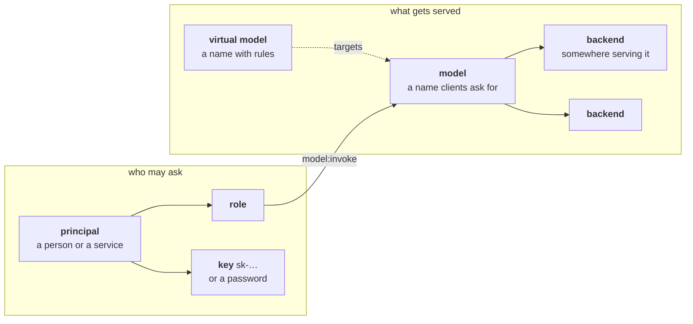
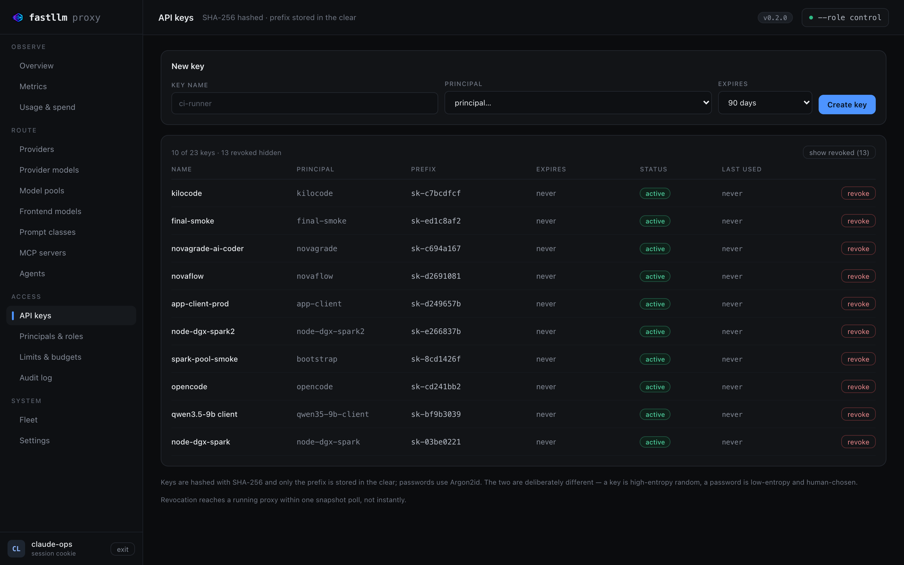

# Getting started

From nothing to a served request, then a tour of what you just installed.

Assumes you have at least one OpenAI-compatible inference server running —
vLLM, SGLang, llama.cpp, Ollama, or a hosted provider's endpoint. This gateway
sits in front of those; it does not run models itself.

## 1. Bring it up

```bash
git clone https://github.com/azrtydxb/Fastllm-proxy && cd Fastllm-proxy
docker compose up -d
```

That starts Postgres, applies the migrations, and runs `--role all` — control
plane and gateway in one process. Two ports:

| | |
|---|---|
| **:4000** | the gateway. Point clients here |
| **:4001** | the admin API and the management UI |

Nothing is configured yet: no models, no keys, and no way in. That is
deliberate — there is no default password to forget to change.

## 2. Give yourself a login

```bash
docker compose exec fastllm fastllm-proxy set-password --name you --password 'change-me'
```

The first login created this way gets the `admin` role automatically. Every
later one has to be granted permissions explicitly, which is the point:
a password proves *who* is calling, not *what* they may do.

Open **`https://localhost:4001/`** and sign in. Your browser will warn about
the certificate — it is self-signed unless you supplied one.

## The five nouns

Everything below is one of these, and the relationships are the whole data
model:



Two backends under one model name make a load-balanced pool. A principal holds
roles; roles carry grants; a key is how a principal proves it is that
principal. Nothing else needs explaining before the first request.

## 3. Add a model

A **model** is a name clients ask for. A **backend** is somewhere that serves
it. Two backends under one model name make a load-balanced pool.

On **Models**, create one, then add a backend to it:


Each row shows what a client needs to know and what an operator needs to
decide: the backends behind the name, whether a credential is set (never the
credential itself), the price per million tokens, whether responses are cached,
and the declared context window.

Or by API, if you would rather script it:

```bash
curl -sk -b /tmp/ck -X POST https://localhost:4001/admin/models \
  -H 'content-type: application/json' -d '{"name":"my-model"}'          # -> {"id":N}

curl -sk -b /tmp/ck -X POST https://localhost:4001/admin/models/N/backends \
  -H 'content-type: application/json' \
  -d '{"api_base":"http://localhost:8000/v1","upstream_model":"Qwen/Qwen3-8B"}'
```

## 4. Mint a key

Keys belong to **principals** — a person or a service — and a principal's
**roles** decide which models it may invoke.



The plaintext is shown once and never again; only a SHA-256 hash and the
prefix are stored. The expiry defaults to 90 days rather than never, which is
the safer default and worth noticing before you wire it into something.

A new principal holds no grants at all, so its key authenticates and then gets
`403 model_access_denied` on everything. Give it a role on **Principals &
roles** first.

## 5. Make a request

```bash
curl http://localhost:4000/v1/chat/completions \
  -H "authorization: Bearer sk-..." -H 'content-type: application/json' \
  -d '{"model":"my-model","messages":[{"role":"user","content":"hi"}]}'
```

That is the whole integration for anything that speaks OpenAI. Point your SDK,
editor or agent at `http://localhost:4000/v1` — see
[Connecting a client](integrations.md) for the exact config for the OpenAI
SDKs, five coding agents and four frameworks.

## Already running LiteLLM?

Skip all of the above:

```bash
fastllm-proxy import --config litellm_config.yaml --database-url postgres://...
```

Models, backends, keys and each key's per-model grants come across. It is
idempotent — re-importing an edited file converges rather than duplicating, and
grants removed from the file are revoked. Your existing keys keep working
against the same models they already had.

## Where next

| | |
|---|---|
| [A tour of the UI](tour.md) | Every screen, what it answers, and the one thing on it worth knowing |
| [Connecting a client](integrations.md) | SDKs, coding agents, frameworks, observability |
| [Troubleshooting](troubleshooting.md) | The failures people actually hit |
