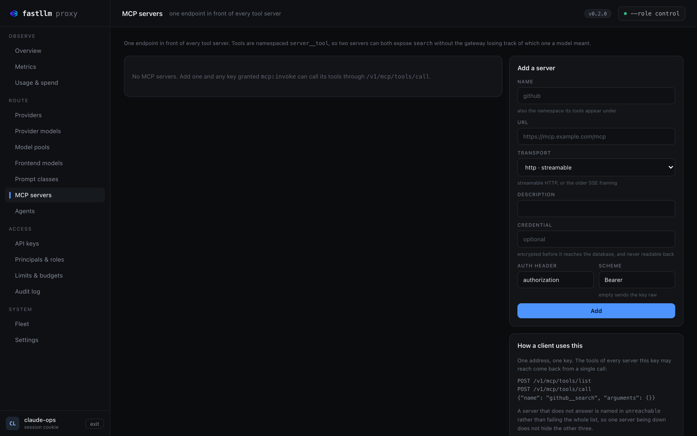

# MCP gateway

**One endpoint in front of every tool server**, for the same reason there is
one in front of every model.

> **Needs a build newer than `v0.1.0`.** This landed after that release, so
> the `ghcr.io/azrtydxb/fastllm-proxy:v0.1.0` that the [portable
> manifests](https://github.com/azrtydxb/Fastllm-proxy/tree/main/deploy/kubernetes),
> the Helm chart and the operator default to does not serve these routes —
> `/admin/*` answers 404 and there is no screen. Pin `:latest` or a `sha-`
> build until the next tagged release.

A team running four MCP servers otherwise hands every agent four addresses,
four credentials and four separate trust decisions — and has nowhere to answer
"which of our keys can reach the one that writes to production". Here a server
is a row, a grant is `mcp:invoke` on `mcp/<name>`, and that question is the
same query it already is for models.



## Adding one

In the UI on **MCP servers**, or by API:

```bash
curl -sk -b /tmp/ck -X POST https://control:4001/admin/mcp-servers \
  -H 'content-type: application/json' -d '{
    "name": "github",
    "url": "https://mcp.github.example/mcp",
    "transport": "http",
    "upstream_api_key": "ghp_..."
  }'
```

| field | |
|---|---|
| `name` | What callers address it by, **and the namespace its tools appear under**. Alphanumeric with `-` or `_` |
| `url` | The server's endpoint |
| `transport` | `http` (MCP's streamable HTTP) or `sse` |
| `auth_header` | Defaults to `authorization` |
| `auth_scheme` | Defaults to `Bearer`; `""` sends the credential raw, which several MCP hosts want |
| `upstream_api_key` | Encrypted with `FASTLLM_ENCRYPTION_KEY` before it reaches Postgres, and never readable back |

**Adding a server grants nobody anything.** It is reachable only by a
principal holding `mcp:invoke` on `mcp/<name>` or `mcp/*` — see
[access](#access) below.

## Calling it

Three endpoints on the gateway (`:4000`), authenticated with an ordinary
`sk-…` key:

```bash
# What this key may reach. Answered from memory — no upstream call.
curl -H "authorization: Bearer sk-..." http://gateway:4000/v1/mcp/servers

# Every tool across every server this key may reach.
curl -XPOST -H "authorization: Bearer sk-..." http://gateway:4000/v1/mcp/tools/list

# Invoke one.
curl -XPOST http://gateway:4000/v1/mcp/tools/call \
  -H "authorization: Bearer sk-..." -H 'content-type: application/json' \
  -d '{"name": "github__search", "arguments": {"q": "is:open label:bug"}}'
```

### Tools are namespaced, and it matters

Every tool comes back as `<server>__<tool>`:

```json
{
  "object": "list",
  "data": [
    {"name": "github__search", "server": "github", "description": "...", "inputSchema": {...}},
    {"name": "jira__search",   "server": "jira",   "description": "...", "inputSchema": {...}}
  ],
  "unreachable": []
}
```

Two servers exposing `search` is the ordinary case, not the exotic one. A tool
name is what the **model** emits in a tool call, so a collision is not a
listing problem — it is the gateway being unable to tell which server the
model meant, after the fact, with no way to ask. An un-namespaced name is
refused with `400` rather than guessed, because guessing means a tool call
landing somewhere the caller did not name. MCP's own spec reached the same
conclusion in SEP-986.

The namespace is stripped on the way out. The server knows its tools by their
own names and has never heard of this gateway's prefix.

### One server being down does not hide the others

`unreachable` names the servers that did not answer, and the tools of the ones
that did are still returned. Four servers with one down should still list the
tools on the other three, and a missing tool should be diagnosable rather than
merely absent.

A `tools/call` to a server that fails answers **502**, not 500: the failure is
upstream, and behind one address that is exactly the distinction a client
needs.

## Access

Grants use the same machinery as models, and are deliberately separate from
them:

```bash
# Every server
curl -sk -b /tmp/ck -X POST https://control:4001/admin/roles/agents/permissions \
  -H 'content-type: application/json' -d '{"verb":"mcp:invoke","resource":"mcp/*"}'

# Or exactly one
  -d '{"verb":"mcp:invoke","resource":"mcp/github"}'
```

**`model:invoke` does not imply `mcp:invoke`.** A key that may invoke every
model is not, by that fact, a key that may reach every tool server: tools have
side effects and models do not. The seeded `inference` role gets models and
not tools; only `admin` gets both.

A server the caller may not reach answers **404**, exactly as one that does
not exist. An unauthorised caller learns nothing about what the deployment
runs.

## Handing the tools to a model

The catalogue comes back in a shape any OpenAI-compatible model accepts, which
is the point of putting a gateway here at all:

```python
tools = requests.post(f"{BASE}/v1/mcp/tools/list",
                      headers={"authorization": f"Bearer {KEY}"}).json()["data"]

openai_tools = [{"type": "function", "function": {
    "name": t["name"], "description": t.get("description", ""),
    "parameters": t.get("inputSchema", {"type": "object"})}} for t in tools]

resp = client.chat.completions.create(model="my-model", messages=msgs, tools=openai_tools)

# The model emits `github__search`; hand it straight back to the gateway.
for call in resp.choices[0].message.tool_calls or []:
    requests.post(f"{BASE}/v1/mcp/tools/call",
                  headers={"authorization": f"Bearer {KEY}"},
                  json={"name": call.function.name,
                        "arguments": json.loads(call.function.arguments)})
```

The same key authenticates the model call and the tool call, and both are
authorised against the same principal — which is what makes "who used which
tool" answerable at all.

## What is deliberately absent

**`stdio` servers.** A gateway that spawns a process on behalf of a request is
a different trust boundary from one that forwards HTTP, and this proxy runs
with a read-only root filesystem and no shell for reasons that still apply. A
stdio server belongs behind an HTTP transport that someone else operates.

**Automatic tool execution inside `/chat/completions`.** LiteLLM will run
returned tool calls and feed the results back when `require_approval` is
`"never"`. That turns one request into an unbounded number of upstream calls
with no budget attached, on a path whose entire design is that it does not
block. The loop belongs in the client, where it can be seen; the example above
is six lines.

**Prompts and resources.** MCP has both. Tools are what agents actually use
and what needs authorising; the other two can follow when something asks for
them rather than shipping as surface nobody calls.

## Where next

| | |
|---|---|
| [Security](security.md) | Where the credential lives, and what `/snapshot` carries |
| [Interactive API reference](api/swagger.md) | The three endpoints and their responses |
| [Providers](providers.md) | The same idea for models |
