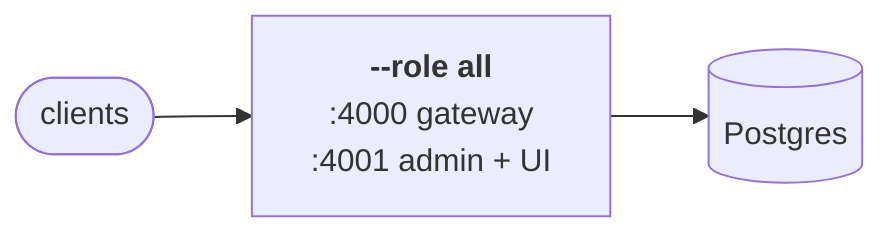
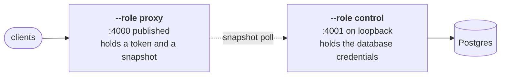
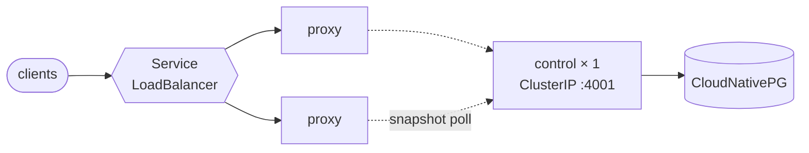
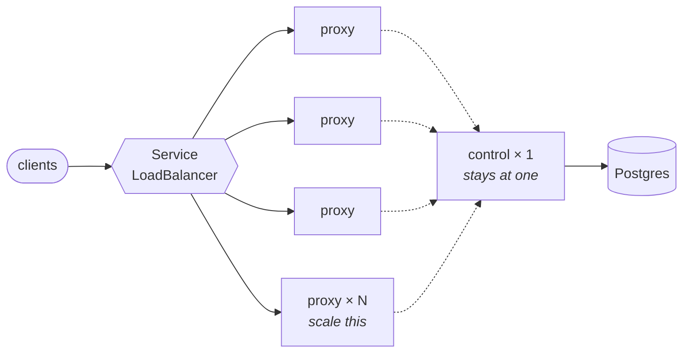

# Running it

Install, the three roles, deployment shapes, and configuration.

## Choosing a shape

Five, in the order deployments actually grow through them. Each is a complete,
working configuration — pick the row that matches where you are.

| | Planes | Good for |
|---|---|---|
| [1. A binary](#1-a-binary) | one process | a laptop, a single box, a VM |
| [2. Docker](#2-docker) | one process | the same, without a toolchain |
| [3. Compose, split](#3-compose-with-the-planes-split) | two containers | one host, admin API off the public port |
| [4. Kubernetes, split](#4-kubernetes-with-the-planes-split) | two Deployments | a cluster, one gateway replica per node |
| [5. Kubernetes, scaled out](#5-kubernetes-scaled-out) | control + N proxies | production traffic |


The dividing line between the first two and the rest is `--role`. One binary
runs in three shapes, and everything below is that one flag plus what each
shape needs to reach its neighbours.

### 1. A binary



```bash
cargo build --release            # target/release/fastllm-proxy
```

Or take a release binary and skip the toolchain. Then, against a Postgres you
already have:

```bash
# Keep this key. It is not regenerable — see below.
export FASTLLM_ENCRYPTION_KEY=$(openssl rand -hex 32)
export FASTLLM_DATABASE_URL=postgres://fastllm@localhost/fastllm

fastllm-proxy --role all --host 0.0.0.0
# gateway on :4000, admin API and UI on :4001
```

`--role all` is control plane and gateway in one process, sharing state
directly — no HTTP round trip between them, and nothing to configure between
them either. Migrations apply at startup.

Then give yourself a login and a key:

```bash
fastllm-proxy set-password --name you --password 'change-me'
```

Three things about this shape worth knowing before you rely on it:

- **`FASTLLM_ENCRYPTION_KEY` is not regenerable.** It encrypts
  `model_backends.upstream_api_key` at rest. Lose it and the upstream
  credentials in that database are gone; change it and the process will not
  start. Put it wherever you keep secrets before you put anything in the
  database.
- **`--host` defaults to loopback.** Binding `0.0.0.0` is a deliberate act,
  which is why it is not the default.
- **:4001 is not a public port.** It serves the admin API, the UI and
  `/snapshot` — and `/snapshot` returns *decrypted* upstream credentials to
  anything holding the proxy token. On one box, leave it on loopback and reach
  it over SSH.

Without a database at all, `--role proxy --config config.yaml` runs `File`
mode: models and keys come from the YAML, nothing is persisted, and there is
no UI. That is the shape that predates the control plane, and it still works
unchanged — see [Per-key RBAC in `File` mode](#per-key-rbac-in-file-mode).

### 2. Docker

Same shape, no toolchain, from the public image:

```bash
docker run -d --name fastllm \
  -p 4000:4000 -p 127.0.0.1:4001:4001 \
  -e FASTLLM_ROLE=all \
  -e FASTLLM_DATABASE_URL=postgres://fastllm@db/fastllm \
  -e FASTLLM_ENCRYPTION_KEY=$(openssl rand -hex 32) \
  ghcr.io/azrtydxb/fastllm-proxy:v0.1.0
```

Note the asymmetry in the port mappings: `:4000` is published, `:4001` is
published to loopback only. That is the same rule as above, expressed in the
place people actually configure it.

With Postgres alongside it, the repo's root `docker-compose.yml` is the whole
thing in one command:

```bash
docker compose up -d
# proxy :4000, admin :4001, postgres :5432
docker compose exec fastllm fastllm-proxy set-password --name you --password 'change-me'
```

The image already sets `FASTLLM_HOST=0.0.0.0` — a container nobody can reach
is not useful — which is why it is absent above and deliberate in shape 1. It
also bakes both classifier models in and points `FASTLLM_CLASSIFIER_MODEL` at
them, so [semantic routing](classifier.md) works here out of the box; a
hand-built binary needs `--features classifier` and a `--classifier-model`.

### 3. Compose, with the planes split



`deploy/docker-compose.split.yml` runs the control plane and the gateway as
separate containers:

```bash
docker compose -f deploy/docker-compose.split.yml up -d
```

Three services: Postgres, `--role control` (database, admin API, UI,
`/snapshot`, no proxy listener), and `--role proxy` pointed at it with
`FASTLLM_CONTROL_URL`. They authenticate to each other with
`FASTLLM_PROXY_TOKEN`, which both must be given the same value of.

What the split buys, on one host, is that the admin API is no longer in the
process serving public traffic. The gateway container has no database
credentials, no encryption key, and no admin surface — it has a snapshot and a
token. If the thing on the public port is the thing you worry about, this is
the shape that shrinks it.

What it costs is a moving part: the gateway now depends on something to start
against. It degrades rather than fails — a proxy that cannot reach its control
plane falls back to the last snapshot it wrote to `--snapshot-cache`
(`/var/lib/fastllm/snapshot.json`, a volume in that file) rather than refusing
to start. **That volume is the whole point of the fallback.** Without it, a
gateway that restarts during a control-plane outage comes up with nothing to
serve.

This shape runs one gateway. Scaling past one wants something to balance
across replicas and a separate snapshot cache per replica — which is where
Compose stops being the right tool.

### 4. Kubernetes, with the planes split



`deploy/` holds the manifests for one real cluster, and they are worth reading
before the chart because they are concrete:

```bash
kubectl apply -f deploy/control.yaml      # Postgres + --role control
kubectl apply -f deploy/configmap.yaml    # the proxy's tuning knobs
kubectl apply -f deploy/deployment.yaml   # --role proxy, 2 replicas
kubectl apply -f deploy/service.yaml      # the gateway's LoadBalancer
```

Two Deployments, and the shape of each follows from what it does:

| | `fastllm-control` | `fastllm-proxy` |
|---|---|---|
| Replicas | 1 | 2+, spread across nodes |
| Holds | database URL, encryption key, proxy token | proxy token, control URL |
| Serves | :4001 admin | :4000 gateway |
| Service | ClusterIP by default | LoadBalancer |
| Storage | the Postgres cluster | an `emptyDir` snapshot cache |

The control plane is one replica deliberately: it is not on the request path,
and a second would race the first rebuilding snapshots for no gain.

The gateway is two, on different nodes, because a gateway that dies with one
node is not a gateway. Prefix affinity is per process, so two replicas mean a
prefix can be cached on two nodes rather than one — the cost of the
redundancy, and it is small.

The control plane's Service is ClusterIP because of `/snapshot` again. The
manifests in `deploy/` do give it a `LoadBalancer` on a pinned VIP, with TLS
from a `Certificate` and a comment saying exactly what that decision rests on:
a session-authenticated admin API, TLS, and a private network. Take away any
one of those three and it should go back to ClusterIP.

### 5. Kubernetes, scaled out



The chart is the generic form of the above:

```bash
helm install fastllm charts/fastllm-proxy \
  --set proxy.replicas=6 \
  --set database.existingSecret=fastllm-pg-app \
  --set secrets.existingSecret=fastllm-secrets \
  --set proxy.policy=cache-affinity
```

Scaling means scaling `proxy`. The control plane stays at one; it does not see
request traffic, and nothing about serving more requests asks for more of it.

What changes as the data plane grows:

| | |
|---|---|
| **Prefix affinity dilutes** | Affinity is per process, so N replicas can hold N copies of a prefix. Fewer, larger replicas cache better than many small ones — the opposite of the usual instinct |
| **Health is per replica** | Each reports its own view. The **Fleet** screen never merges them: one replica seeing a backend down while others do not is a partition, and averaging deletes the only symptom |
| **Rate limits are per replica** | Counters are in memory, reconciled against the database periodically. A 60/min limit across 6 replicas is approximately 60/min, not exactly. Budgets, which are cumulative, do not have this property |
| **Snapshot versions can differ** | A replica on an older snapshot answers `/health` with `ok` and misbehaves only on whatever changed — usually a key it has never seen. The Fleet screen's version column is where that shows |

For the request path itself, `--workers` and `--pool-max-idle` are the knobs
that matter, and `docs/performance.md` has the measurements rather than the
intuitions.

## Roles

One binary, three ways to run it, via `--role` (`FASTLLM_ROLE`):

| Role | What it does | Needs |
|---|---|---|
| `proxy` (default) | Forwarding only, against either a control plane (`Http` mode) or a config file (`File` mode) | `--control-url` + `--proxy-token` (`Http` mode), or `--config` alone (`File` mode) |
| `all` | Control plane and forwarding in one process, sharing state directly — no HTTP round trip between them | `--database-url`, `FASTLLM_ENCRYPTION_KEY` |
| `control` | Database, admin API (`/admin/*` — keys, principals, roles, models, backends), `/snapshot` and `/usage` — no proxy listener | `--database-url`, `FASTLLM_ENCRYPTION_KEY` |

`proxy` is the default deliberately, not `all`: it is the only role that asks for nothing beyond what a pre-control-plane deployment already passed (`--config` and nothing else), so an existing deployment upgrades to this binary without gaining a new required flag. `all` and `control` are explicit opt-ins via `--role`/`FASTLLM_ROLE`.

`Http` mode degrades gracefully: a `proxy` that cannot reach its control plane at startup, or loses it later, falls back to the last snapshot it wrote to `--snapshot-cache` (default `/var/lib/fastllm/snapshot.json`) rather than refusing to start or dropping traffic.

### Migrating a `File`-mode deployment onto a database

```bash
fastllm-proxy import --config litellm_config.yaml --database-url postgres://...
```

Idempotent — seeds `models`/`model_backends` **and the `auth:` block** (a `service_account` principal per key, the key itself as a SHA-256 hash, and its model grants) from a LiteLLM-format config, and can be run more than once safely. Point `--role=all`/`control` at the same database afterward and the same keys keep working, with the same per-model authorisation they had in `File` mode.

Each imported key gets its own role, `import:<name>`, holding just that key's grants — `models: ['*']` becomes `model:invoke` on `model/*` (i.e. allow-all), a named list becomes one grant per model. Re-importing an edited file converges: grants dropped from the file are revoked, not merely left behind. `import` never prints a key back; the config file is the only copy of the plaintext.

Day-to-day changes after the initial seed go through the admin API below rather than another `import` run or hand-written SQL, so they reach a running control plane immediately instead of on its next periodic rebuild.

### First key, by API

Principal `1` is the `bootstrap` service account the migrations seed, already
holding the `inference` role. For anything beyond a first key, create your own:

```bash
# A principal, then a role for it, then a key against it.
curl -XPOST localhost:4001/admin/principals -H 'content-type: application/json' \
  -d '{"name":"ci-pipeline"}'                       # -> {"id":2,...}
curl -XPOST localhost:4001/admin/principals/2/roles -H 'content-type: application/json' \
  -d '{"role":"inference"}'
curl -XPOST localhost:4001/admin/keys -H 'content-type: application/json' \
  -d '{"name":"ci","principal_id":2,"expires_at":"2027-01-01T00:00:00Z"}'
```

(`import`, run on the host rather than inside the container, needs the same
`FASTLLM_ENCRYPTION_KEY` the control plane was given — they share one
database, so they must agree on one key.)

## Configuration

The schema is a superset of the LiteLLM proxy config, so a file generated by `sparkrun proxy start` works as-is:

```yaml
model_list:
  # Two entries sharing a model_name become one load-balanced pool.
  - model_name: Qwen/Qwen3-1.7B
    litellm_params:
      model: openai/Qwen/Qwen3-1.7B
      api_base: http://10.24.11.13:8000/v1
      api_key: not-needed
  - model_name: Qwen/Qwen3-1.7B
    litellm_params:
      model: openai/Qwen/Qwen3-1.7B
      api_base: http://10.24.11.14:8000/v1

  # An alias: clients say "gpt-4", the upstream is sent its real name.
  - model_name: gpt-4
    litellm_params:
      model: openai/Qwen/Qwen3-1.7B
      api_base: http://10.24.11.13:8000/v1

general_settings:
  master_key: sk-...

# Optional, ignored by LiteLLM so one file can drive either.
fastllm:
  prefix_bytes: 2048      # bytes of the raw body hashed for the affinity key
  balance_abs: 8          # absolute in-flight slack before affinity yields
  balance_rel: 1.5        # relative slack multiplier
  affinity_slots: 65536   # prefix-affinity cache entries
  unhealthy_after: 2      # consecutive failed probes before eviction
```

`openai/`, `vllm/`, `hosted_vllm/` and `openai_like/` prefixes are stripped from `litellm_params.model`; a name that is genuinely `Qwen/Qwen3-1.7B` keeps its org. `not-needed`, `none` and `null` API keys are treated as absent.

### Per-key RBAC in `File` mode

`--master-key`/`general_settings.master_key` is one shared secret for every client and is deprecated. The replacement in `File` mode (no `--control-url`) is an `auth:` block:

```yaml
auth:
  keys:
    - key: sk-...
      name: ci-pipeline
      models: ["qwen3-6-35b-a3b-nvfp4"]   # `["*"]` for every model; an empty
                                          # or omitted list grants nothing
      expires_at: "2027-01-01T00:00:00Z"  # RFC 3339, optional
      limits:                             # optional; absent means unlimited
        requests_per_min: 60
        tokens_per_min: 100000
      budget:                             # optional; absent means unlimited
        tokens_total: 1000000
        tokens_used: 0                    # optional starting point; static —
                                           # File mode has no reconciliation
                                           # loop to advance it on its own
```

Absent `auth:` means open (no key required) — today's behaviour when no master key is set either. In `Http` mode (`--control-url` given), `auth:` is ignored: keys live in the database and are managed through the control plane's admin API instead. `fastllm-proxy import` carries an existing `auth:` block into that database unchanged (see "Migrating a `File`-mode deployment" above), so the same keys authorise the same models on either side of the move. `limits` is `File` mode's mirror of the control plane's `limits` table (see "Rate limits" above) — either field alone, both, or neither. `budget` is the same mirror of the `budgets` table (see "P3: usage accounting and budgets" above).

### Tuning affinity

`balance_abs` / `balance_rel` set how much imbalance is tolerated before cache locality is given up. Higher values favour cache hits; lower values favour even load. The default (8 requests absolute, 1.5× relative) suits a small cluster of a few nodes with long shared system prompts. If your traffic has little prefix sharing, `--policy least-loaded` is the honest choice and skips the bookkeeping.

`--policy lowest-latency` is for a pool whose members are **not** equivalent — a fast GPU beside a slower one, or a local node beside a hosted provider. Least-loaded is misled there: a slow backend with one request queued looks emptier than a fast one with two, so it keeps being fed. This ranks by an exponentially weighted mean of recent whole-request latency instead, tie-broken by in-flight so equally fast backends still balance.

Three properties worth knowing before choosing it:

- **A backend with no completed requests is eligible, not fastest.** Treating an unmeasured backend as 0 µs would hand it the whole pool before it proved anything; excluding it would mean a newly added backend never got a request and so never earned an estimate.
- **Backends within 12.5% of the best are treated as equal.** Without that band the pool oscillates — whichever backend last finished quickest wins every subsequent pick until its own queue slows it down.
- **It is cache-blind.** On matched nodes serving long shared prefixes, `cache-affinity` wins: a prefix cache hit is worth far more than a few hundred microseconds of measured difference between identical machines. That is why the default did not change.

---

Back to the [README](../README.md).

## Logs

`--log-format text` (the default) is human-readable; `--log-format json`
(`FASTLLM_LOG_FORMAT=json`) emits one JSON object per line with the event's
fields at the top level rather than nested, which is what a collector indexes
without a transform step:

```json
{"timestamp":"2026-08-08T08:29:54.896902Z","level":"INFO","message":"starting",
 "models":1,"backends":1,"policy":"CacheAffinity","role":"Proxy"}
```

`--log` (`FASTLLM_LOG`) takes an `EnvFilter` directive, so
`--log 'info,fastllm_proxy::proxy=debug'` turns on per-request routing and
classification detail without the rest.

## Metrics worth knowing about

Most are self-describing from their `# HELP` text. Four are not obvious:

- **`fastllm_classify_escalations_total` is not `fastllm_classified_refined_total`.**
  The second counts prompts the transformer *decided*; the first counts prompts
  it was *asked about*. When it declines, the fast tier's answer stands and is
  counted as `classified_fast`. The gap between them is how often the expensive
  tier ran and changed nothing, and the escalation rate itself is the number the
  two-tier design is justified on.
- **`fastllm_backend_duration_seconds` versus `fastllm_model_duration_seconds`.**
  A model's p99 rising says the model got slow. The per-backend one says which
  replica did, which is the difference between "the provider is degraded" and
  "one of our two GPUs is".
- **`fastllm_upstream_status_total` keeps 429 separate from other 4xx.** It is
  the retryable one, and the reason a pool that passes every health check can
  still refuse a request — lumping it with client errors hides the signal that
  explains a failover.
- **`fastllm_snapshot_age_seconds` compares two machines' clocks**, since the
  stamp is the control plane's. It is clamped at zero rather than going
  negative on skew, which would read as a broken exporter.

- **`fastllm_cache_total{kind="hit"|"miss"|"store"}` counts three things, not
  two.** A miss that is never stored is a response the cache declined to keep —
  streaming, an error, too large — so `store` well below `miss` is the cache
  working as intended on uncacheable traffic, not a bug. `fastllm_cache_entries`
  and `fastllm_cache_bytes` are the live occupancy against the configured
  bounds.

`fastllm_build_info` is a constant 1 carrying the version as a label — the
conventional shape, and what turns "latency moved at 14:02" into "latency moved
when we shipped this".

## Shutdown

On SIGTERM (or Ctrl-C) the proxy stops accepting connections, tells every open
one to stop keep-alive, and waits for in-flight requests to finish before
exiting — `--shutdown-grace` (`FASTLLM_SHUTDOWN_GRACE`, 25s) bounds the wait,
sitting under Kubernetes' 30s `terminationGracePeriodSeconds`.

This matters for a streaming gateway specifically: a generation can run for
minutes, and cutting it produces a response that stops mid-sentence with no
error for the client to retry on. Measured against a 6-second stream with the
signal sent 2 seconds in: at the default the client received every frame
including `[DONE]`; at `--shutdown-grace 0` it received two frames and nothing
else.

If the grace expires with connections still open, they are closed and the
count is logged at WARN — those are requests somebody is still waiting on, and
silence would make the truncation look like a client bug.

## What each replica can see

`GET /admin/fleet` on the control plane reports, per proxy replica, its
backends' health and in-flight counts and the snapshot version it is serving.
Proxies push this every `--health-report-interval` (default 10s) over the same
`--proxy-token` channel as usage.

Two questions it answers that `/metrics` cannot without scraping every pod:
whether the fleet agrees a backend is up — a single replica that disagrees is a
network partition, not a dead backend — and whether every replica is on the
same snapshot version, which is how a pod stuck on an old configuration becomes
visible.

Nothing is stored: a replica that stops reporting ages out after 30 seconds.
"Up, 40 minutes ago" is not health.

## Notifications

Everything this gateway knows is already published — `/metrics` to scrape,
`/admin/fleet` to poll, `usage_events` to query. All of it requires somebody
to be looking. `--webhook-url` is the other direction, for the conditions
worth telling someone about at 3am:

| event | when |
|---|---|
| `backend_down` | a replica newly reports a backend unhealthy |
| `backend_recovered` | the same backend reporting healthy again |
| `snapshot_rebuild_failed` | a rebuild failed *after* a write committed, so the database and the published snapshot have diverged |

**Transitions, not states.** A backend that is down stays down, and a health
report every ten seconds would otherwise become six alerts a minute for one
incident. A replica's *first* report emits nothing at all — there is no
previous state to have changed from, and a control-plane restart would
otherwise announce every already-down backend as though it had just failed.

**Per replica, not merged.** Every replica losing a backend is a dead
backend; one replica losing it is a partition. Merging them here would delete
the distinction before anyone saw it, which is the same reason
`GET /admin/fleet` never averages replicas together.

`--webhook-secret` signs each body with HMAC-SHA256 in `x-fastllm-signature`,
in the `sha256=<hex>` form most receivers already know. A webhook endpoint is
reachable by anyone who learns its address, so a receiver that *acts* on
notifications wants to know where they came from.

Delivery is one attempt with a five-second timeout and no retry, from a small
bounded queue. A receiver that is down will still be down in five seconds,
and a retry loop would turn one unreachable endpoint into a queue that never
drains — while the condition being reported is still true and still visible
on `/metrics` and `/admin/fleet`. Notifications dropped because the queue was
full are counted rather than silently discarded.

## Per-request records

`usage_events` carries latency and outcome alongside the token counts:
`duration_ms`, `ttft_ms`, `status`, and `requested_model` when the client asked
for a name that differs from the one that served it — a virtual model, or the
head of a chain that failed over.

**One row per request that reached a backend**, whether or not the response
carried token counts. `usage_reported` says which: `false` means the counts are
unknown, not zero, and such a row has `cost_micros` NULL rather than 0. Any
query that sums tokens or spend should filter on it — `WHERE usage_reported` —
while any query counting *requests* must not, since the rows it would exclude
are disproportionately the ones that failed.

**Refusals are recorded too**, and `refusal` says which kind. It is NULL for
every row describing a response a backend actually returned, and set for the
four cases the gateway decides itself:

| `refusal` | status | meaning |
|---|---|---|
| `authorisation` | 403 | authenticated, but not granted the model |
| `rate_limit` | 429 | over a configured per-minute limit |
| `budget` | 402 | budget window exhausted |
| `no_backend` | 502 | nothing in the chain could be reached |

`no_backend` is why the column exists. A refused request has no forwarded
response body, and the body is what writes the row — so before this, a total
backend outage produced *no rows at all* and an error rate computed here read
a flat zero at exactly the moment nothing worked.

Keep the two apart when charting. `refusal IS NULL AND status >= 400` is
"errors an upstream returned"; `refusal IS NOT NULL` is "requests the gateway
turned away". Blending them into one error rate tells an operator to do
neither of the two available things — raise a budget, or go and look at a GPU
node.

### Retention

`usage_events` takes one row per request now, so it has a policy rather than
needing watching: **raw rows for 90 days, hourly rollups beyond that, kept
indefinitely.** An hourly task folds everything past the cutoff into
`usage_rollup_hourly` and deletes the rows it summarised — in one
transaction, because doing the two separately would lose any request written
between the summary and the delete.

`/admin/timeseries` reads both tables and unions them, so a chart does not
end at the retention boundary. What changes across it is granularity, and one
thing more:

**Rolled-up buckets report no latency at all.** Percentiles do not merge —
averaging two hours' p95 produces a number that is the p95 of nothing — so
the rollup stores `duration_ms_sum` and `duration_ms_count` and the API
returns `null` for p50/p95 over rolled-up data. The chart breaks its line
there, the same as for an empty bucket, rather than drawing a continuous
line whose meaning silently changed 90 days back. A mean is recoverable from
the two stored columns by anyone who wants one.

To keep raw rows longer, change `RAW_RETENTION_DAYS` in `src/control/api.rs`;
the roll-up is additive (`ON CONFLICT DO UPDATE`), so a longer window simply
folds later.

**Refusals with nobody to attribute them** — a 401 from an invalid key, a 404
for a model that does not exist — are in `gateway_rejections` instead, and
`/admin/timeseries` reports them as `refused_unattributed`. So a
caller-visible error total *is* answerable from Postgres alone; it is simply
two tables, because the two kinds of failure are shaped differently.

They are counts bucketed to the minute per replica, not rows per request, and
that is deliberate: 401 is the one refusal an anonymous stranger can trigger
at will, so a row apiece would let unauthenticated traffic drive unbounded
writes. The counters ride the health report the proxies already send every
ten seconds; the control plane holds each replica's previous report, so it
stores the delta. A counter that went *down* means that replica restarted,
and the new value is taken as the delta rather than producing a negative. A
replica's first report is skipped rather than counted from zero — its counter
covers however long that process has been alive, and charging all of it to
the current minute would draw a spike that never happened.

These rows carry no model and no principal, so they are **excluded whenever
you filter by either**. A filtered view that included them would attribute
anonymous failures to whichever model or caller you happened to be looking
at.

This is where per-caller detail lives, and deliberately not in Prometheus: the
answer to "which callers got slow" is per principal and per key, and a label
with that cardinality is how a metrics endpoint becomes an outage. Here it is a
column in a database, already batched off the request path.

```sql
SELECT p.name, count(*), percentile_cont(0.95)
         WITHIN GROUP (ORDER BY u.ttft_ms) AS p95_ttft_ms
FROM usage_events u JOIN principals p ON p.id = u.principal_id
WHERE u.at > now() - interval '1 hour' AND u.ttft_ms IS NOT NULL
GROUP BY p.name ORDER BY p95_ttft_ms DESC;
```

Every new column is nullable, and that is load bearing. `ttft_ms` is NULL for a
non-streaming response, where it would be a copy of `duration_ms` rather than a
second measurement; all four are NULL on a row written by a proxy that predates
them. A zero would be indistinguishable from a request that answered instantly.

One limit worth knowing: a usage row exists only for principals whose
consumption is tracked — those with a budget or a token rate limit — because
nothing else parses the response body. Per-model *metrics* cover every request;
per-caller *rows* cover those.

## Traces

Built only with `--features otel`, because it is the one part of telemetry that
adds a dependency tree (opentelemetry plus tonic/gRPC) and the only one needing
something deployed to receive it. A build without the feature carries none of
it and pays nothing at runtime — the instrumentation compiles away.

```
--otel-endpoint http://collector:4317   # unset disables tracing
--otel-sample-one-in 100                # 1 traces everything
--otel-service-name fastllm-proxy
```

One span per request, `chat_completion`, carrying the requested model, the
model that actually served it, the backend, whether it streamed, the prompt
class if one matched, the upstream status, and how many attempts it took. That
last pair is the reason to reach for a trace rather than a metric: a histogram
says the 99th percentile moved, a span says *this* request failed over twice
and landed on the fallback.

Deliberately not recorded as span attributes: the request body, the caller's
principal, or any credential. A tracing backend is a log with a nicer UI, and
prompts do not belong in one.

Two behaviours worth knowing:

- **Sampling is by counting, not randomly.** One request in `n` exactly, rather
  than a ratio that is only right on average — at low volume a random sampler
  means a quiet hour traces nothing. An upstream sampling decision is honoured
  before this one, so the proxy never punches a hole in the middle of somebody
  else's trace.
- **An unreachable collector is not an outage.** If the exporter cannot be
  built at startup the proxy logs it and serves traffic untraced; export itself
  is a background batch task, so a collector that goes away costs dropped spans
  rather than dropped requests.

## Keeping prices current

`fastllm-proxy sync-prices --database-url "$URL"` fills in any model whose
price is unset, from OpenRouter's published list and the community catalogue.
`--dry-run` first; the next snapshot rebuild picks the change up, with no
restart.

Worth running on a schedule, and worth knowing what it is *not*: where a
provider reports what it actually charged — OpenRouter returns `usage.cost`
unasked — that figure is used instead and this table is never consulted. The
sync matters for providers that publish a price but do not report one per
request.
