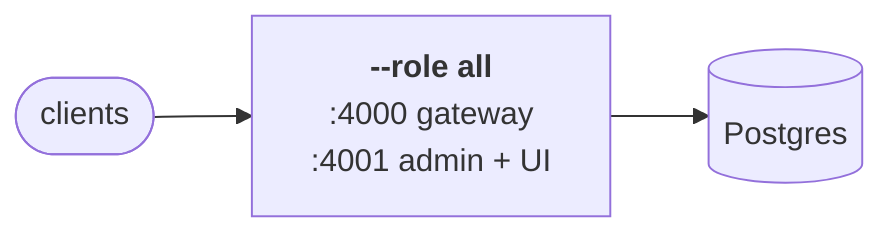
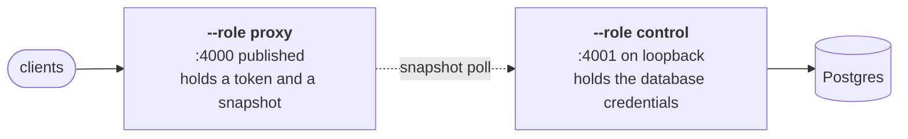
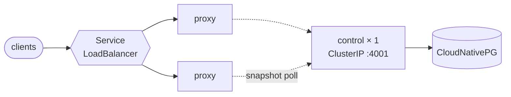

# Deployment shapes

Five, in the order deployments actually grow through them. Each is a
complete, working configuration — pick the one that matches where you are.

## Choosing a shape

Five, in the order deployments actually grow through them. Each is a complete,
working configuration — pick the row that matches where you are.

|                                                             | Planes              | Good for                                                    |
| ----------------------------------------------------------- | ------------------- | ----------------------------------------------------------- |
| [1. A binary](#1-a-binary)                                  | one process         | a laptop, a single box, a VM                                |
| [2. Docker](#2-docker)                                      | one process         | the same, without a toolchain                               |
| [3. Compose, split](#3-compose-with-the-planes-split)       | two containers      | one host, admin API off the public port                     |
| [4. Kubernetes, split](#4-kubernetes-with-the-planes-split) | two Deployments     | a cluster, one gateway replica per node                     |
| [5. Kubernetes, scaled out](#5-kubernetes-scaled-out)       | control + N proxies | production traffic — manifests, Helm chart, or the operator |

The dividing line between the first two and the rest is `--role`. One binary
runs in three shapes, and everything below is that one flag plus what each
shape needs to reach its neighbours.

### 1. A binary



```bash
cargo build --release            # target/release/fastllm-proxy
```

Or take a release binary and skip the toolchain. Then, against a Postgres you
already have:

```bash
# Keep this key. It is not regenerable — see below.
export FASTLLM_ENCRYPTION_KEY=$(openssl rand -hex 32)
export FASTLLM_DATABASE_URL=postgres://fastllm@localhost/fastllm

fastllm-proxy --role all --host 0.0.0.0
# gateway on :4000, admin API and UI on :4001
```

`--role all` is control plane and gateway in one process, sharing state
directly — no HTTP round trip between them, and nothing to configure between
them either. Migrations apply at startup.

Then give yourself a login and a key:

```bash
fastllm-proxy set-password --name you --password 'change-me'
```

Three things about this shape worth knowing before you rely on it:

- **`FASTLLM_ENCRYPTION_KEY` is not regenerable.** It encrypts
  `providers.upstream_api_key` at rest. Lose it and the upstream
  credentials in that database are gone; change it and the process will not
  start. Put it wherever you keep secrets before you put anything in the
  database.
- **`--host` defaults to loopback.** Binding `0.0.0.0` is a deliberate act,
  which is why it is not the default.
- **:4001 is not a public port.** It serves the admin API, the UI and
  `/snapshot` — and `/snapshot` returns _decrypted_ upstream credentials to
  anything holding the proxy token. On one box, leave it on loopback and reach
  it over SSH.

There is also a `File` mode — `--role proxy --config config.yaml`, no
database — that predates the control plane and still works unchanged, so a
deployment upgrading to this binary does not break. It is compatibility, not a
recommendation: nothing is persisted, there is no UI, no usage accounting and
no audit log. Every shape below assumes the database, and
[`import`](configuration.md#migrating-a-file-mode-deployment-onto-a-database)
is how a `File`-mode deployment moves onto one.

### 2. Docker

Same shape, no toolchain, from the public image:

```bash
docker run -d --name fastllm \
  -p 4000:4000 -p 127.0.0.1:4001:4001 \
  -e FASTLLM_ROLE=all \
  -e FASTLLM_DATABASE_URL=postgres://fastllm@db/fastllm \
  -e FASTLLM_ENCRYPTION_KEY=$(openssl rand -hex 32) \
  ghcr.io/azrtydxb/fastllm-proxy:v0.2.0
```

Note the asymmetry in the port mappings: `:4000` is published, `:4001` is
published to loopback only. That is the same rule as above, expressed in the
place people actually configure it.

With Postgres alongside it, the repo's root `docker-compose.yml` is the whole
thing in one command:

```bash
docker compose up -d
# proxy :4000, admin :4001, postgres :5432
docker compose exec fastllm fastllm-proxy set-password --name you --password 'change-me'
```

The image already sets `FASTLLM_HOST=0.0.0.0` — a container nobody can reach
is not useful — which is why it is absent above and deliberate in shape 1. It
also bakes both classifier models in and points `FASTLLM_CLASSIFIER_MODEL` at
them, so [semantic routing](../classifier.md) works here out of the box; a
hand-built binary needs `--features classifier` and a `--classifier-model`.

### 3. Compose, with the planes split



`deploy/docker-compose.split.yml` runs the control plane and the gateway as
separate containers:

```bash
docker compose -f deploy/docker-compose.split.yml up -d
```

Three services: Postgres, `--role control` (database, admin API, UI,
`/snapshot`, no proxy listener), and `--role proxy` pointed at it with
`FASTLLM_CONTROL_URL`. They authenticate to each other with
`FASTLLM_PROXY_TOKEN`, which both must be given the same value of.

What the split buys, on one host, is that the admin API is no longer in the
process serving public traffic. The gateway container has no database
credentials, no encryption key, and no admin surface — it has a snapshot and a
token. If the thing on the public port is the thing you worry about, this is
the shape that shrinks it.

What it costs is a moving part: the gateway now depends on something to start
against. It degrades rather than fails — a proxy that cannot reach its control
plane falls back to the last snapshot it wrote to `--snapshot-cache`
(`/var/lib/fastllm/snapshot.json`, a volume in that file) rather than refusing
to start. **That volume is the whole point of the fallback.** Without it, a
gateway that restarts during a control-plane outage comes up with nothing to
serve.

This shape runs one gateway. Scaling past one wants something to balance
across replicas and a separate snapshot cache per replica — which is where
Compose stops being the right tool.

### 4. Kubernetes, with the planes split



`deploy/` holds the manifests for one real cluster, and they are worth reading
before the chart because they are concrete:

```bash
kubectl apply -f deploy/control.yaml      # Postgres + --role control
kubectl apply -f deploy/configmap.yaml    # the proxy's tuning knobs
kubectl apply -f deploy/deployment.yaml   # --role proxy, 2 replicas
kubectl apply -f deploy/service.yaml      # the gateway's LoadBalancer
```

Two Deployments, and the shape of each follows from what it does:

|          | `fastllm-control`                         | `fastllm-proxy`              |
| -------- | ----------------------------------------- | ---------------------------- |
| Replicas | 1                                         | 2+, spread across nodes      |
| Holds    | database URL, encryption key, proxy token | proxy token, control URL     |
| Serves   | :4001 admin                               | :4000 gateway                |
| Service  | ClusterIP by default                      | LoadBalancer                 |
| Storage  | the Postgres cluster                      | an `emptyDir` snapshot cache |

The control plane is one replica deliberately: it is not on the request path,
and a second would race the first rebuilding snapshots for no gain.

The gateway is two, on different nodes, because a gateway that dies with one
node is not a gateway. Prefix affinity is per process, so two replicas mean a
prefix can be cached on two nodes rather than one — the cost of the
redundancy, and it is small.

The control plane's Service is ClusterIP because of `/snapshot` again. The
manifests in `deploy/` do give it a `LoadBalancer` on a pinned VIP, with TLS
from a `Certificate` and a comment saying exactly what that decision rests on:
a session-authenticated admin API, TLS, and a private network. Take away any
one of those three and it should go back to ClusterIP.

### 5. Kubernetes, scaled out

Three ways to express the same two Deployments. The first two differ in how
they are written; the third differs in what happens _after_ the write.

|                                                                                        |                                                                                                                            |
| -------------------------------------------------------------------------------------- | -------------------------------------------------------------------------------------------------------------------------- |
| [Manifests](https://github.com/azrtydxb/Fastllm-proxy/tree/main/deploy/kubernetes)     | `kubectl apply -k deploy/kubernetes/base/`. Read exactly what is applied, and edit it. Overlays for TLS and a LoadBalancer |
| [Helm chart](https://github.com/azrtydxb/Fastllm-proxy/tree/main/charts/fastllm-proxy) | Values rather than patches, and templating across many environments                                                        |
| [Operator](https://github.com/azrtydxb/Fastllm-proxy/tree/main/operator)               | A `FastllmProxy` resource, reconciled continuously                                                                         |

```bash
# Manifests
kubectl apply -k deploy/kubernetes/base/

# Helm
helm install fastllm charts/fastllm-proxy \
  --set proxy.replicas=6 \
  --set database.existingSecret=fastllm-pg-app \
  --set secrets.existingSecret=fastllm-secrets

# Operator
kubectl apply -f operator/deploy/crd.yaml
kubectl apply -f operator/deploy/operator.yaml -f operator/deploy/rbac.yaml
kubectl apply -f operator/deploy/example.yaml
```

**What the operator adds** is not templating — a chart describes the
deployment once, at apply time, and four things it cannot describe are the
reason to run a controller:

|                                                  |                                                                                                                                                                                                                                                                        |
| ------------------------------------------------ | ---------------------------------------------------------------------------------------------------------------------------------------------------------------------------------------------------------------------------------------------------------------------- |
| **Upgrades are ordered**                         | The two planes share a database schema. `spec.image` rolls the _control plane first_, and the gateway is held at the image it is running until that has finished. An image that cannot be pulled therefore takes the control plane down and leaves the gateway serving |
| **A rotated Secret rolls the pods that read it** | `secretKeyRef` env is resolved once, at container start. The pod templates carry a hash of the resolved material, so rotating the proxy token — or cert-manager renewing the control-plane certificate — is a rollout instead of a change that quietly does nothing    |
| **A bad configuration is refused, not deployed** | Every referenced Secret is resolved and checked before anything is applied. A missing key or a 31-byte encryption key becomes a condition naming the Secret and the key, rather than pods in `CreateContainerConfigError`                                              |
| **The install finishes**                         | `bootstrap` runs `set-password` as a Job once the control plane is ready, so the deployment ends with a UI somebody can log into rather than one nobody can                                                                                                            |

```console
$ kubectl -n fastllm get fllm
NAME      PHASE   GATEWAY   CONTROL   IMAGE                                   AGE
fastllm   Ready   3/3       true      ghcr.io/azrtydxb/fastllm-proxy:v0.2.0   2m
```

`IMAGE` is what is actually serving, not what was asked for — during an
upgrade it lags `spec.image`, which is the point of printing it.

Scaling means scaling `proxy`, by `replicas` or by `autoscaling` (an HPA on
CPU; the controller then stops writing the replica count so the two do not
fight). The control plane stays at one — it does not see request traffic, and
nothing about serving more requests asks for more of it, so no install path
exposes a replica count for it.

What changes as the data plane grows:

|                                  |                                                                                                                                                                                                       |
| -------------------------------- | ----------------------------------------------------------------------------------------------------------------------------------------------------------------------------------------------------- |
| **Prefix affinity dilutes**      | Affinity is per process, so N replicas can hold N copies of a prefix. Fewer, larger replicas cache better than many small ones — the opposite of the usual instinct                                   |
| **Health is per replica**        | Each reports its own view. The **Fleet** screen never merges them: one replica seeing a backend down while others do not is a partition, and averaging deletes the only symptom                       |
| **Rate limits are per replica**  | Counters are in memory, reconciled against the database periodically. A 60/min limit across 6 replicas is approximately 60/min, not exactly. Budgets, which are cumulative, do not have this property |
| **Snapshot versions can differ** | A replica on an older snapshot answers `/health` with `ok` and misbehaves only on whatever changed — usually a key it has never seen. The Fleet screen's version column is where that shows           |

For the request path itself, `--workers` and `--pool-max-idle` are the knobs
that matter, and [the performance chapter](../performance.md) has the
measurements rather than the intuitions.
