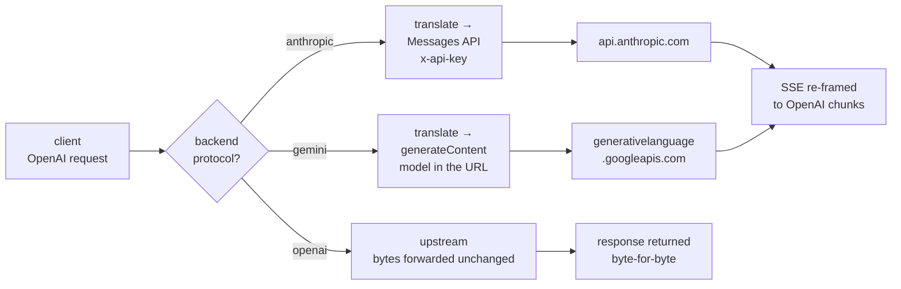

# Providers

**Adding a provider is a row in a table — not a code change, not a release.**
Anything speaking the OpenAI API is already supported whether or not it is on
the list below; the list exists so you do not have to go and find the base URL.


The **Providers** screen is where an endpoint and its credential are added and
kept. A provider is a row in `providers` — since migration 0029 it is a record
rather than a grouping the screen used to invent by bucketing backends on their
`api_base`. Each card answers the question you actually have: how many models
ride on it, whether a credential is set (never the credential itself), and how
many of its models are up.

**Add provider** offers two ways in, which differ only in where the address
comes from:

- **Cloud provider** — pick a vendor from the catalogue, which carries every
  provider named on this page; the list has a filter, because eighty entries is
  more than anyone wants to scroll. Its wire protocol and the header it wants
  its key in are filled in for you, and its base URL where that is a fixed,
  verified address.

  Fifty-eight of the eighty-one carry a fixed address, each read off a source
  that dials it — LiteLLM's `openai_compatible_endpoints` and provider configs,
  `go-ai-sdk`, or the vendor's own documentation — and the catalogue's `notes`
  records which, so that when a vendor moves one there is somewhere to go and
  check.

  The other twenty-three carry a `<placeholder>`, and `POST /admin/providers`
  refuses to store an address with one still in it. Those are the cases nobody
  but you can fill in: a self-hosted engine runs wherever you started it, and an
  account-scoped endpoint encodes a resource, region, workspace or app that only
  your account knows (Azure, Bedrock, Vertex, Databricks, Snowflake, Cloudflare,
  Heroku). The entry still earns its place — it fills in the protocol and the
  header that vendor wants its key in, which is the half that is easy to get
  wrong.
- **Custom endpoint** — type the address of anything else: a vLLM on the LAN,
  an Ollama on a workstation, a gateway of your own. Protocol defaults to
  `openai`, which is what almost everything speaks.

Nothing is served by adding a provider. It carries the endpoint and the
credential; which of its models to expose is a separate, deliberate step on
**Provider models** — because a cloud provider can front hundreds, and
registering all of them is not what anyone means by adding one.

## The catalogue

**80 providers work today — 78 reached as-is, 2 through their own wire
format.** The count and these tables are checked against each other by
`tests/doc_claims.rs`, so the number cannot drift away from the rows.

A caveat these tables are explicit about, because the number is otherwise a
boast: **"works" here means "is a configuration row that this proxy will
forward to correctly"**, which follows from the endpoint being OpenAI-shaped.
The ones exercised against real traffic in this repo's tests and on its dev
cluster are marked ✓. The rest carry the base URL their vendor documents —
check it against their docs before pasting it into production, because vendors
move them and this file cannot notice.

| reached as-is (OpenAI-compatible)                        |                                                                                                                                                                                                       |
| -------------------------------------------------------- | ----------------------------------------------------------------------------------------------------------------------------------------------------------------------------------------------------- |
| **OpenRouter** ✓ (fronts ~400 models)                    | `https://openrouter.ai/api/v1`                                                                                                                                                                        |
| OpenAI · Groq · DeepSeek · xAI                           | `api.openai.com` · `api.groq.com` · `api.deepseek.com` · `api.x.ai`                                                                                                                                   |
| Together · Fireworks · Nebius · AtlasCloud               | four endpoints, four rows                                                                                                                                                                             |
| Mistral · Perplexity · Cerebras · SambaNova              | `api.mistral.ai/v1` · `api.perplexity.ai` · `api.cerebras.ai/v1` · `api.sambanova.ai/v1`                                                                                                              |
| DeepInfra · Novita · Hyperbolic · Lambda                 | four endpoints, four rows                                                                                                                                                                             |
| Z.ai · BigModel · Aliyun DashScope · Qwen Cloud          |                                                                                                                                                                                                       |
| Moonshot / Kimi · Baidu Qianfan · AIHubMix               |                                                                                                                                                                                                       |
| MiniMax · Volcengine Ark · Tencent Hunyuan · Sarvam      | Chinese and Indian clouds, same row shape                                                                                                                                                             |
| Baseten · Featherless · FriendliAI · Chutes              |                                                                                                                                                                                                       |
| Nscale · GMI Cloud · Scaleway · OVHcloud                 |                                                                                                                                                                                                       |
| Cloudflare Workers AI · Vercel AI Gateway · v0 · Poe     |                                                                                                                                                                                                       |
| NanoGPT · CometAPI · Inception · Morph                   |                                                                                                                                                                                                       |
| Clarifai · Weights & Biases · GradientAI · AI21          |                                                                                                                                                                                                       |
| Snowflake Cortex · Anyscale · Heroku · CompactifAI       |                                                                                                                                                                                                       |
| GitHub Models · GitHub Copilot                           |                                                                                                                                                                                                       |
| **Amazon Bedrock**                                       | `https://bedrock-runtime.<region>.amazonaws.com/openai/v1`, Bedrock API key as a bearer token                                                                                                         |
| **Cohere**                                               | `https://api.cohere.ai/compatibility/v1`                                                                                                                                                              |
| **Google Vertex AI**                                     | `https://<region>-aiplatform.googleapis.com/v1/projects/<project>/locations/<region>/endpoints/openapi` — see [the API reference](providers.md#verified-base-urls) for the service-account credential |
| **Azure OpenAI** · Azure AI                              | `https://<resource>.openai.azure.com/openai/deployments/<deployment>` with `auth_header: api-key` and `auth_scheme: ""` — the key goes in its own header with no `Bearer` prefix                      |
| NVIDIA NIM · Databricks · HuggingFace TGI                | `integrate.api.nvidia.com/v1` · a serving endpoint · any TGI `/v1`                                                                                                                                    |
| vLLM ✓ · SGLang · llama.cpp ✓ · Ollama                   | self-hosted, same row shape                                                                                                                                                                           |
| LM Studio · KoboldCpp · TabbyAPI · text-generation-webui | local servers, same row shape                                                                                                                                                                         |
| Xinference · Llamafile · Docker Model Runner · Lemonade  | local servers, same row shape                                                                                                                                                                         |
| **Voyage AI** · **Jina AI** · Infinity · TEI             | embeddings and rerank — `/v1/embeddings`, `/v1/rerank`                                                                                                                                                |

| reached through their own wire format |                                                                                       |
| ------------------------------------- | ------------------------------------------------------------------------------------- |
| **Anthropic**                         | `"protocol": "anthropic"` — Messages API, `x-api-key`, SSE re-framed to OpenAI chunks |
| **Gemini**                            | `"protocol": "gemini"` — `generateContent`, model in the URL, `x-goog-api-key`        |

## Picking one

The **Provider models** screen offers a provider list: choose one and its base
URL, protocol and auth header are filled in, so you paste a key and stop.

What is in that list is what this page documents an *endpoint* for. It names
about a hundred providers and gives a host for thirty-odd of them; the rest are
counted rather than specified, and seeding them would mean inventing base URLs.
A list that confidently prefills a wrong endpoint is worse than one that admits
it does not know.

So the list is a convenience, never a limit — anything speaking the OpenAI API
works whether or not it is on it, and the address is always typeable. Two
entries keep `<region>` placeholders (Bedrock, Vertex) rather than being
prefilled with something that cannot resolve.

## Adding one

A provider model is one model name on one provider, so there are two steps: the
endpoint, then what you want off it.

In the UI, on **Providers**, press **Add provider** and give it a credential.
Then on **Provider models**:


press **Add model**. The dialog asks for the provider first, then reads that
endpoint's own answer to `GET /v1/models` and offers what it serves — not what
a catalogue believes it offers — with the ones you have already registered
marked. Pick one and the local name is filled in from it, editable before
anything is created.

The order matters: naming a model first and finding it an address afterwards
leaves a model that routes nowhere in between, and asks you to know the
upstream name from memory before anything has offered it.

A provider that does not implement `/v1/models` says so in the dialog, and the
upstream name stays typeable. Both writes are one intent: if attaching fails,
the model created a moment earlier is removed rather than left behind as a
name that routes nowhere and blocks the retry with a duplicate-name conflict.

By API, the same three calls:

```bash
# The endpoint and its key, once. A catalogue_key fills in the rest.
curl -sk -b /tmp/ck -X POST https://control:4001/admin/providers \
  -H 'content-type: application/json' \
  -d '{"catalogue_key":"openrouter","upstream_api_key":"sk-or-..."}'   # -> {"id":3}

curl -sk -b /tmp/ck -X POST https://control:4001/admin/provider-models \
  -H 'content-type: application/json' -d '{"name":"kimi-k2"}'          # -> {"id":7}

curl -sk -b /tmp/ck -X POST https://control:4001/admin/provider-models/7/backends \
  -H 'content-type: application/json' \
  -d '{"provider_id":3,"upstream_model":"moonshotai/kimi-k2"}'
```

Naming a `provider_id` settles the address, the protocol and the credential, so
none of them may be sent alongside it — the API refuses rather than quietly
preferring one source, which would leave you believing you had set a key here
while the provider's is what actually gets sent.

Attaching by address still works, and still finds or creates a provider from
it. That is how every backend was attached before providers were records, and
it is what a LiteLLM import and every existing script does:

```bash
curl -sk -b /tmp/ck -X POST https://control:4001/admin/provider-models/7/backends \
  -H 'content-type: application/json' -d '{
    "api_base": "https://api.moonshot.ai/v1",
    "upstream_model": "moonshot-v1-128k",
    "upstream_api_key": "sk-..."
  }'
```

The same model on two providers is two provider models, and a frontend model in
front of them is what balances the two — two entries sharing a `model_name` in a
LiteLLM config
[import](operations/configuration.md#migrating-a-file-mode-deployment-onto-a-database)
to exactly that shape. It is the whole mechanism behind failover and traffic
splitting — see
[frontend models](features.md#frontend-models-routing-as-configuration-not-code)
for routing between _different_ models.

## Credentials

`upstream_api_key` is encrypted at rest with `FASTLLM_ENCRYPTION_KEY` before it
reaches Postgres, and the admin API never reads one back — the UI shows
_whether_ a credential is set, never what it is.

**One credential per provider, however many models ride on it.** That is the
point of the split: rotating a key is one write, from the provider card's
**rotate key**, or `PATCH /admin/providers/{id}` with a new
`upstream_api_key` — not one write per model. An absent `upstream_api_key`
there leaves the stored one alone, so renaming a provider does not require
re-sending a key nothing can read back; `""` clears it.

Two knobs exist because not every vendor puts the key in `authorization:
Bearer`:

|               |                                                       |
| ------------- | ----------------------------------------------------- |
| `auth_header` | the header name. Default `authorization`              |
| `auth_scheme` | the prefix. Default `Bearer`; `""` sends the key bare |

Azure OpenAI is the case that needs both: `auth_header: api-key` and
`auth_scheme: ""`. Amazon Bedrock, despite the reputation, needs neither —
its OpenAI-compatible endpoint takes a Bedrock API key as an ordinary bearer
token, so it is a plain row like any other and there is no request signing.

## Two providers speak their own language

Anthropic and Gemini do not expose an OpenAI-shaped endpoint, so they are
reached through a translator rather than a base URL:



Tool calling translates in both directions, streaming included, as do image
and audio inputs. Translation is **opt-in per backend**: it costs parsing, and
the whole latency argument for this gateway rests on not parsing. An `openai`
backend's response body is never deserialised, which is why the two paths in
that diagram are drawn differently — one forwards bytes, the other builds
them.

The translation limits, field by field, are in
[the API reference](providers.md#verified-base-urls).

## Verified base URLs

Most providers are OpenAI-compatible, so they need no code at all — just a
backend row pointing at their base URL. That includes **OpenRouter**, which
itself fronts Anthropic, Gemini and several hundred other models in OpenAI
format:

```bash
curl -X POST https://control/admin/provider-models/$MODEL_ID/backends \
  -H 'content-type: application/json' -b "$SESSION" \
  -d '{"api_base":"https://openrouter.ai/api/v1",
       "upstream_model":"anthropic/claude-sonnet-4",
       "upstream_api_key":"sk-or-..."}'
```

Verified base URLs for the OpenAI-compatible set:

| provider         | `api_base`                                                                                              |
| ---------------- | ------------------------------------------------------------------------------------------------------- |
| OpenRouter       | `https://openrouter.ai/api/v1`                                                                          |
| OpenAI           | `https://api.openai.com/v1`                                                                             |
| Groq             | `https://api.groq.com/openai/v1`                                                                        |
| DeepSeek         | `https://api.deepseek.com/v1`                                                                           |
| xAI              | `https://api.x.ai/v1`                                                                                   |
| Together         | `https://api.together.xyz/v1`                                                                           |
| Fireworks        | `https://api.fireworks.ai/inference/v1`                                                                 |
| Nebius           | `https://api.studio.nebius.ai/v1`                                                                       |
| AtlasCloud       | `https://api.atlascloud.ai/v1`                                                                          |
| AIHubMix         | `https://aihubmix.com/v1`                                                                               |
| Z.ai             | `https://api.z.ai/api/paas/v4`                                                                          |
| BigModel         | `https://open.bigmodel.cn/api/paas/v4`                                                                  |
| Aliyun DashScope | `https://dashscope.aliyuncs.com/compatible-mode/v1`                                                     |
| Qwen Cloud       | `https://dashscope-intl.aliyuncs.com/compatible-mode/v1`                                                |
| Moonshot / Kimi  | `https://api.moonshot.cn/v1`, `https://api.moonshot.ai/v1`                                              |
| Baidu Qianfan    | `https://qianfan.baidubce.com/v2`                                                                       |
| GitHub Models    | `https://models.github.ai/inference`                                                                    |
| Ollama           | `http://localhost:11434`                                                                                |
| Cohere           | `https://api.cohere.ai/compatibility/v1`                                                                |
| Amazon Bedrock   | `https://bedrock-runtime.<region>.amazonaws.com/openai/v1`                                              |
| Google Vertex AI | `https://<region>-aiplatform.googleapis.com/v1/projects/<project>/locations/<region>/endpoints/openapi` |

**Bedrock** needs no request signing. Its OpenAI-compatible endpoint takes a
Bedrock API key as an ordinary bearer token, so it is a plain backend row like
any other — create the key in the Bedrock console and put it in
`upstream_api_key`.

## What is deliberately absent

**Deliberately absent**, and not counted: providers whose API is not OpenAI-shaped and would need a fourth translator in `src/protocol/` — Replicate, Predibase, Petals, Triton, WatsonX, OCI Generative AI, AWS SageMaker. Also absent are the non-LLM services a gateway has no business proxying blind: speech (Deepgram, ElevenLabs), image generation (Stability, Black Forest Labs, Recraft, Fal, RunwayML), vector stores (Milvus), and other people's gateways (Helicone, LiteLLM itself). Counting those would inflate the number without making anything work.

## Where next

|                                                           |                                                                  |
| --------------------------------------------------------- | ---------------------------------------------------------------- |
| [API and administration](providers.md#verified-base-urls) | Verified base URLs, and the per-field translation limits         |
| [What it can do](features.md)                             | Routing between providers, not just to them                      |
| [Operations](operations.md)                               | Where the encryption key lives, and why it cannot be regenerated |
