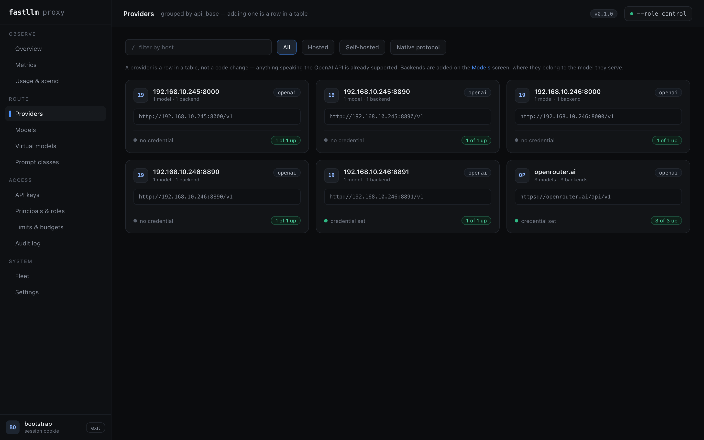
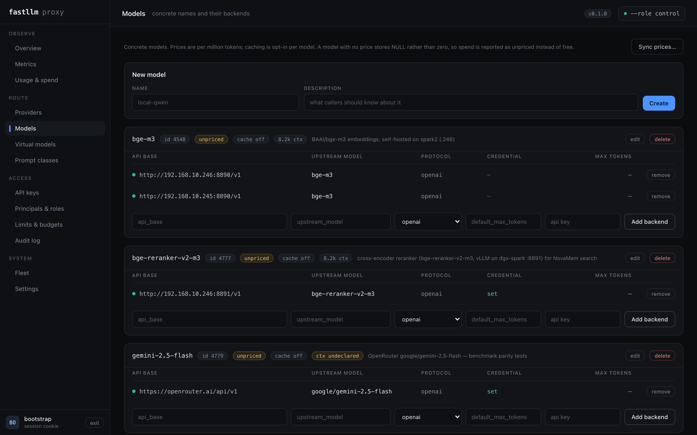
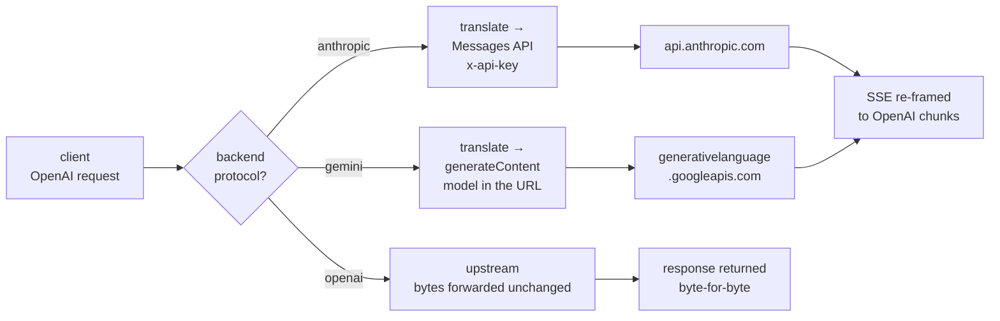

# Providers

**Adding a provider is a row in a table — not a code change, not a release.**
Anything speaking the OpenAI API is already supported whether or not it is on
the list below; the list exists so you do not have to go and find the base URL.



The **Providers** screen groups what you are actually talking to, by host. A
provider is a grouping this screen invents rather than a record the API
models — the database has models and backends, and "OpenRouter" is what a
human calls every backend pointing at `openrouter.ai`. What each card answers
is the question you actually have: how many models ride on it, whether a
credential is set (never the credential itself), and how many of its backends
are up.

## The catalogue

**80 providers work today — 78 reached as-is, 2 through their own wire
format.** The count and these tables are checked against each other by
`tests/doc_claims.rs`, so the number cannot drift away from the rows.

A caveat these tables are explicit about, because the number is otherwise a
boast: **"works" here means "is a configuration row that this proxy will
forward to correctly"**, which follows from the endpoint being OpenAI-shaped.
The ones exercised against real traffic in this repo's tests and on its dev
cluster are marked ✓. The rest carry the base URL their vendor documents —
check it against their docs before pasting it into production, because vendors
move them and this file cannot notice.

| reached as-is (OpenAI-compatible) | |
|---|---|
| **OpenRouter** ✓ (fronts ~400 models) | `https://openrouter.ai/api/v1` |
| OpenAI · Groq · DeepSeek · xAI | `api.openai.com` · `api.groq.com` · `api.deepseek.com` · `api.x.ai` |
| Together · Fireworks · Nebius · AtlasCloud | four endpoints, four rows |
| Mistral · Perplexity · Cerebras · SambaNova | `api.mistral.ai/v1` · `api.perplexity.ai` · `api.cerebras.ai/v1` · `api.sambanova.ai/v1` |
| DeepInfra · Novita · Hyperbolic · Lambda | four endpoints, four rows |
| Z.ai · BigModel · Aliyun DashScope · Qwen Cloud | |
| Moonshot / Kimi · Baidu Qianfan · AIHubMix | |
| MiniMax · Volcengine Ark · Tencent Hunyuan · Sarvam | Chinese and Indian clouds, same row shape |
| Baseten · Featherless · FriendliAI · Chutes | |
| Nscale · GMI Cloud · Scaleway · OVHcloud | |
| Cloudflare Workers AI · Vercel AI Gateway · v0 · Poe | |
| NanoGPT · CometAPI · Inception · Morph | |
| Clarifai · Weights & Biases · GradientAI · AI21 | |
| Snowflake Cortex · Anyscale · Heroku · CompactifAI | |
| GitHub Models · GitHub Copilot | |
| **Amazon Bedrock** | `https://bedrock-runtime.<region>.amazonaws.com/openai/v1`, Bedrock API key as a bearer token |
| **Cohere** | `https://api.cohere.ai/compatibility/v1` |
| **Google Vertex AI** | `https://<region>-aiplatform.googleapis.com/v1/projects/<project>/locations/<region>/endpoints/openapi` — see [the API reference](api.md#providers) for the service-account credential |
| **Azure OpenAI** · Azure AI | `https://<resource>.openai.azure.com/openai/deployments/<deployment>` with `auth_header: api-key` and `auth_scheme: ""` — the key goes in its own header with no `Bearer` prefix |
| NVIDIA NIM · Databricks · HuggingFace TGI | `integrate.api.nvidia.com/v1` · a serving endpoint · any TGI `/v1` |
| vLLM ✓ · SGLang · llama.cpp ✓ · Ollama | self-hosted, same row shape |
| LM Studio · KoboldCpp · TabbyAPI · text-generation-webui | local servers, same row shape |
| Xinference · Llamafile · Docker Model Runner · Lemonade | local servers, same row shape |
| **Voyage AI** · **Jina AI** · Infinity · TEI | embeddings and rerank — `/v1/embeddings`, `/v1/rerank` |

| reached through their own wire format | |
|---|---|
| **Anthropic** | `"protocol": "anthropic"` — Messages API, `x-api-key`, SSE re-framed to OpenAI chunks |
| **Gemini** | `"protocol": "gemini"` — `generateContent`, model in the URL, `x-goog-api-key` |

## Adding one

Three ways, same result. A backend belongs to the model it serves, so you add
a model first and then a backend under it.

In the UI, on **Models**:



By API:

```bash
curl -sk -b /tmp/ck -X POST https://control:4001/admin/models \
  -H 'content-type: application/json' -d '{"name":"kimi-k2"}'    # -> {"id":7}

curl -sk -b /tmp/ck -X POST https://control:4001/admin/models/7/backends \
  -H 'content-type: application/json' -d '{
    "api_base": "https://api.moonshot.ai/v1",
    "upstream_model": "moonshot-v1-128k",
    "upstream_api_key": "sk-..."
  }'
```

Or in `File` mode, as YAML — the LiteLLM schema, unchanged:

```yaml
model_list:
  - model_name: kimi-k2
    litellm_params:
      model: openai/moonshot-v1-128k
      api_base: https://api.moonshot.ai/v1
      api_key: sk-...
```

Two entries sharing a `model_name` become one load-balanced pool. That is the
whole mechanism behind failover and traffic splitting — see
[virtual models](features.md#virtual-models-routing-as-configuration-not-code)
for routing between *different* models.

## Credentials

`upstream_api_key` is encrypted at rest with `FASTLLM_ENCRYPTION_KEY` before it
reaches Postgres, and the admin API never reads one back — the UI shows
*whether* a credential is set, never what it is.

Two knobs exist because not every vendor puts the key in `authorization:
Bearer`:

| | |
|---|---|
| `auth_header` | the header name. Default `authorization` |
| `auth_scheme` | the prefix. Default `Bearer`; `""` sends the key bare |

Azure OpenAI is the case that needs both: `auth_header: api-key` and
`auth_scheme: ""`. Amazon Bedrock, despite the reputation, needs neither —
its OpenAI-compatible endpoint takes a Bedrock API key as an ordinary bearer
token, so it is a plain row like any other and there is no request signing.

## Two providers speak their own language

Anthropic and Gemini do not expose an OpenAI-shaped endpoint, so they are
reached through a translator rather than a base URL:



Tool calling translates in both directions, streaming included, as do image
and audio inputs. Translation is **opt-in per backend**: it costs parsing, and
the whole latency argument for this gateway rests on not parsing. An `openai`
backend's response body is never deserialised, which is why the two paths in
that diagram are drawn differently — one forwards bytes, the other builds
them.

The translation limits, field by field, are in
[the API reference](api.md#providers).

## What is deliberately absent

**Deliberately absent**, and not counted: providers whose API is not OpenAI-shaped and would need a fourth translator in `src/protocol/` — Replicate, Predibase, Petals, Triton, WatsonX, OCI Generative AI, AWS SageMaker. Also absent are the non-LLM services a gateway has no business proxying blind: speech (Deepgram, ElevenLabs), image generation (Stability, Black Forest Labs, Recraft, Fal, RunwayML), vector stores (Milvus), and other people's gateways (Helicone, LiteLLM itself). Counting those would inflate the number without making anything work.

## Where next

| | |
|---|---|
| [API and administration](api.md#providers) | Verified base URLs, and the per-field translation limits |
| [What it can do](features.md) | Routing between providers, not just to them |
| [Operations](operations.md) | Where the encryption key lives, and why it cannot be regenerated |
