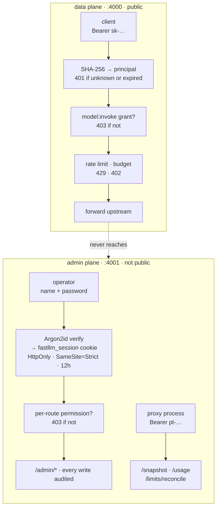

# Security model

Who can call what, how secrets are stored, and where the trust boundaries are.
The detail behind each claim here is in
[the API reference](api/auth.md#admin-authentication); this page is the map.

## Three kinds of caller, three mechanisms

They are separate on purpose. A password proves a human is who they say; a
random key identifies a service; a proxy token says "I am a process in this
deployment". Collapsing any two of them means one leak costs more than it
should.

| caller                                       | credential                | verified with         |
| -------------------------------------------- | ------------------------- | --------------------- |
| A client calling the gateway                 | API key, `sk-…`           | SHA-256               |
| A human using the admin UI                   | password → session cookie | Argon2id              |
| A proxy replica talking to its control plane | `--proxy-token`           | constant-time compare |

**Keys hash with SHA-256, passwords with Argon2id, and that difference is
deliberate.** An API key is high-entropy random, so the only attack is
stealing it and a fast hash costs nothing; a password is low-entropy and
human-chosen, so it needs a hash that is slow on purpose. Unifying them would
either make key verification needlessly expensive on the request path or make
password cracking cheap. Do not unify them.

## Authorisation is not authentication

A valid session establishes _who_ is calling. Every `/admin/*` handler then
checks _what_ that principal may do:

| permission                  |                                                             |
| --------------------------- | ----------------------------------------------------------- |
| `config:write`              | Models, backends, virtual models, principals, roles, limits |
| `key:create` / `key:revoke` | API keys                                                    |
| `usage:read`                | Usage, spend, audit, metrics                                |
| `model:invoke`              | Per model, and the only one the data plane checks           |

A principal that can log in is not, by that fact, an administrator. This
closed a real gap: any principal a password had ever been set for used to be a
full admin, because nothing checked past "is this a valid session".

**A grant on a virtual model does not unlock the concrete models behind it**,
and failover drops any candidate the caller lacks `model:invoke` on —
including the deployment-wide fallback. Routing can never widen a caller's
reach, which is the property that makes it safe to let routing be
configuration.

## What is stored, and in what form

|                               | stored as             | readable back?                                |
| ----------------------------- | --------------------- | --------------------------------------------- |
| API keys                      | SHA-256 hash + prefix | **No.** Plaintext shown once at creation      |
| User passwords                | Argon2id              | No                                            |
| Session tokens                | random, server-side   | No                                            |
| Upstream provider credentials | AES-256-GCM at rest   | Not through the API — only whether one is set |

**No route returns a credential.** `api_keys.hash` is a verifier, not a
display value, and is in no response body.

`upstream_api_key` is the one secret that cannot be reduced to a hash — the
proxy has to present it to the backend as a bearer token — so it is encrypted
with `FASTLLM_ENCRYPTION_KEY` (32 bytes, `openssl rand -hex 32`) before it
reaches Postgres, and `--role control`/`all` refuses to start without the key
rather than falling back to plaintext.

Be precise about what that buys: **it protects the database, not the
snapshot.** Someone with read access to Postgres — a backup, a replica, a
leaked `pg_dump` — no longer gets every upstream credential for free. It does
nothing about `/snapshot`, which necessarily carries the credential in usable
form.

## The one boundary to get right

`/snapshot` returns **decrypted** upstream credentials to anything holding the
proxy token, because the data plane cannot present a credential it cannot
read. Three consequences, and they are not negotiable:

1. **The admin port must never share an address with the gateway.** Its
   callers hold inference keys and have no business reaching it.
2. **`/snapshot` must be TLS wherever a backend has a real credential.**
   `--tls-cert`/`--tls-key`, and `--ca-bundle` on the proxy side for a
   privately-issued certificate.
3. **The proxy token is a credential-bearing secret**, not a service
   discovery detail. Generate it (`pt-$(openssl rand -hex 24)`), keep it in a
   Secret, and rotate it like one.

Exposing the admin Service at all rests on three properties holding together:
a session-authenticated admin API, TLS, and a private network. Take away any
one and it should go back to ClusterIP. The manifests in `deploy/` say so
where the decision is made, rather than here where nobody applying them would
read it.

## Every change is recorded

Every mutating admin call is audited before it is written, with the actor and
the target. Three absences are deliberate:

- **Reads are not recorded.** It answers "what changed", not "who looked".
- **Rejected attempts are not recorded.** A 403 wrote nothing, and an audit
  log that fills with them is one nobody reads.
- **The request body is never captured.** It carries passwords and upstream
  credentials, and an audit log is exactly the wrong place to put them.

A failed audit write never fails the request. Losing a row is serious; losing
the change _and_ the record of it is worse.

## Defaults that are deliberately inconvenient

|                                   |                                                                                                                     |
| --------------------------------- | ------------------------------------------------------------------------------------------------------------------- |
| **No default password**           | A fresh database has no login anyone can obtain. `set-password` is run once by whoever already holds cluster access |
| **`--host` is loopback**          | Binding `0.0.0.0` is an act                                                                                         |
| **Keys expire in 90 days**        | Not "never"                                                                                                         |
| **A new principal holds nothing** | Its key authenticates, then gets 403 on everything until it is given a role                                         |
| **`--role proxy` is the default** | The role that needs no database, no encryption key, and no admin surface                                            |

## Reporting something

Security issues go to the repository's private advisory form rather than a
public issue. If a claim on this page is false, that is itself the report —
this repository has shipped a doc claiming credentials were encrypted before
they were, and it was review that caught it, not the author.

## Where next

|                                                            |                                                       |
| ---------------------------------------------------------- | ----------------------------------------------------- |
| [API and administration](api/auth.md#admin-authentication) | Route-by-route detail, and the session cookie's flags |
| [Operations](operations/shapes.md)                         | Which deployment shape puts what on the public port   |
| [Architecture](architecture.md)                            | Where each check happens, and why none of them is I/O |
