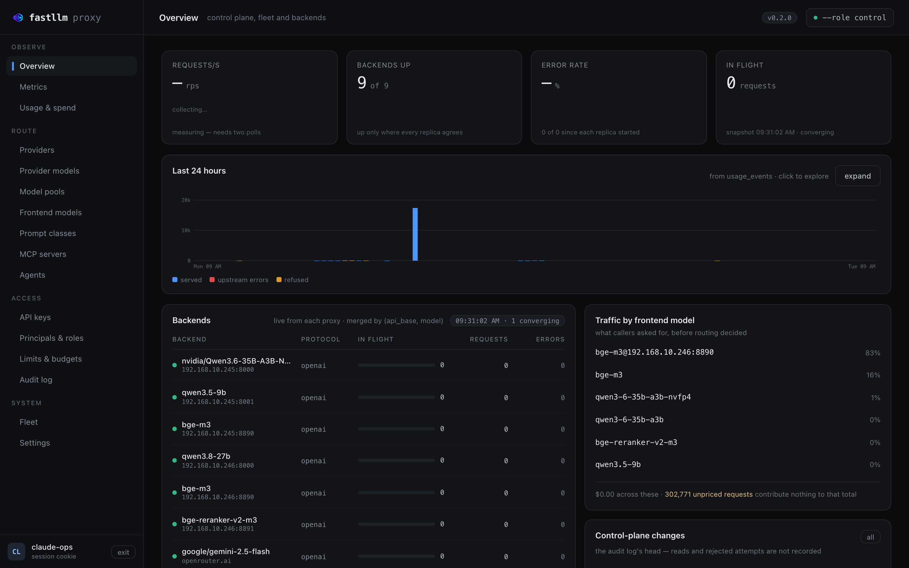
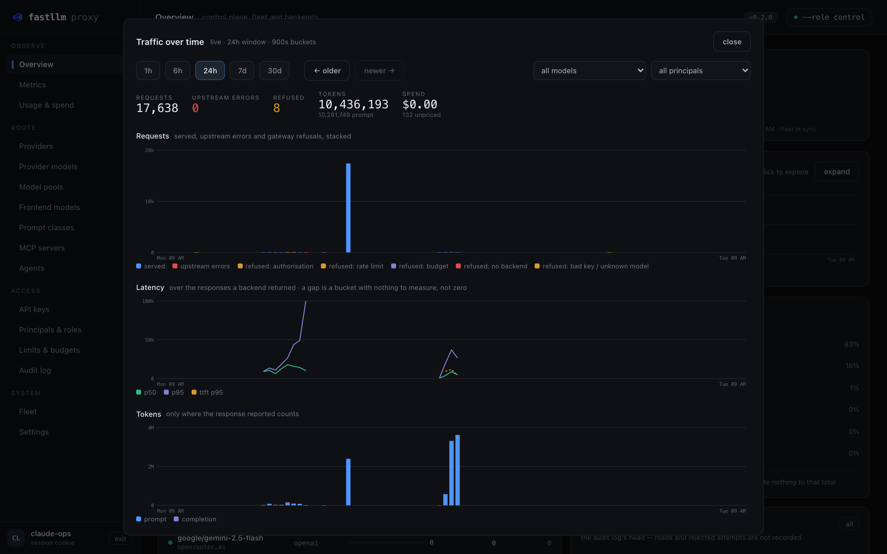
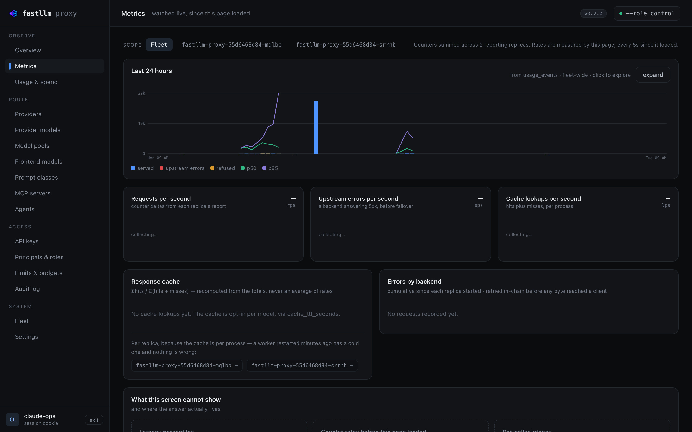
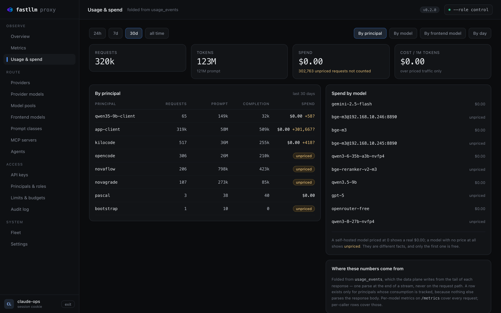
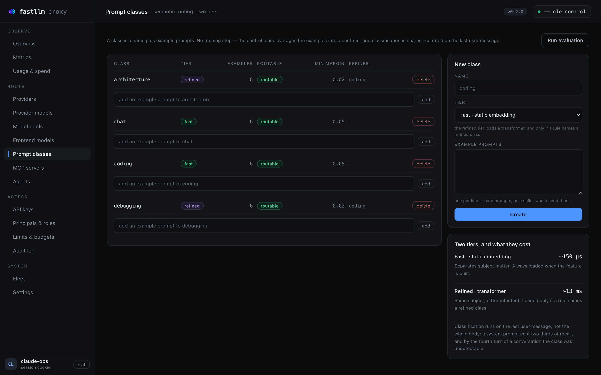
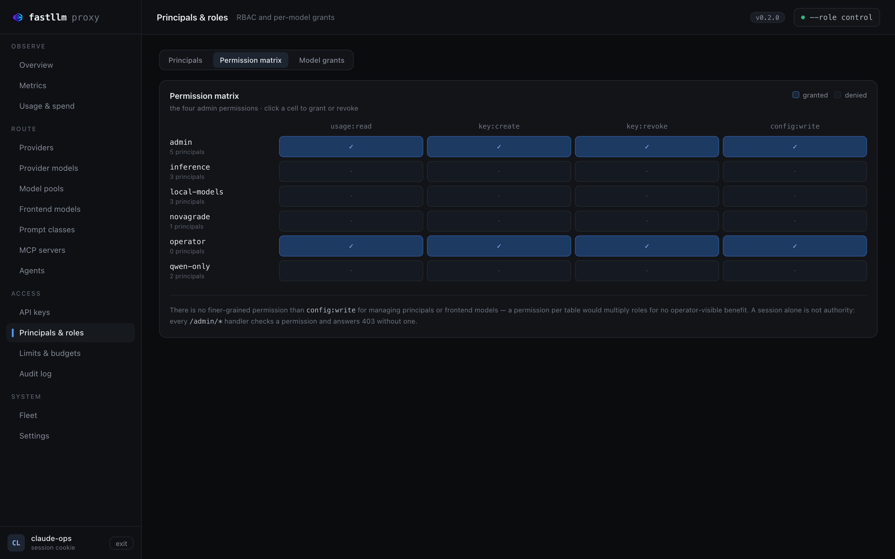
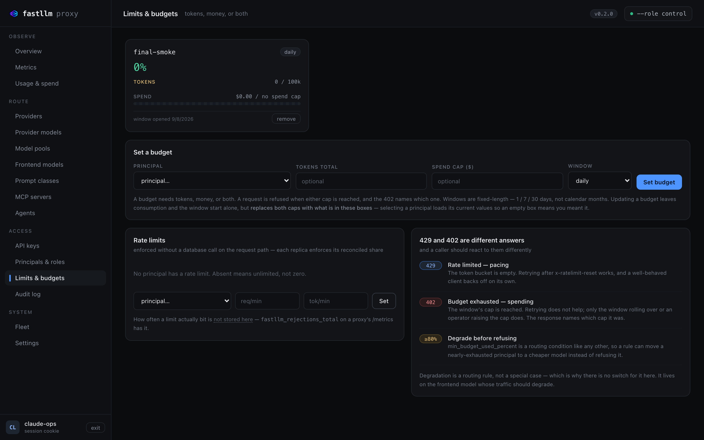
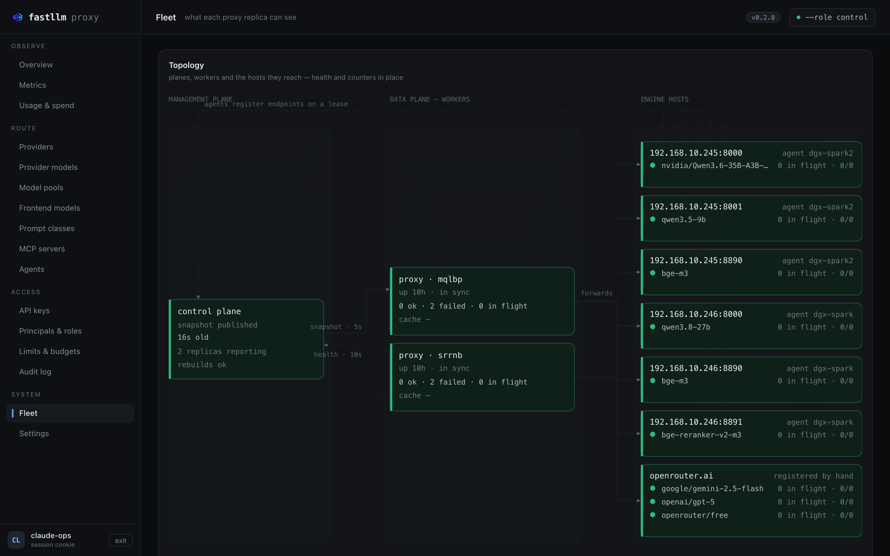
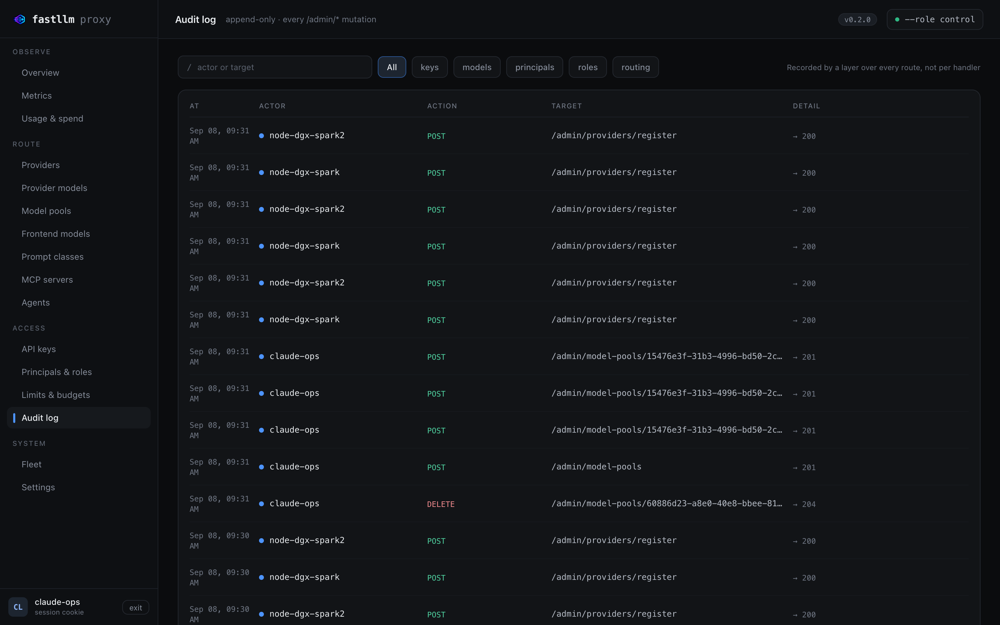
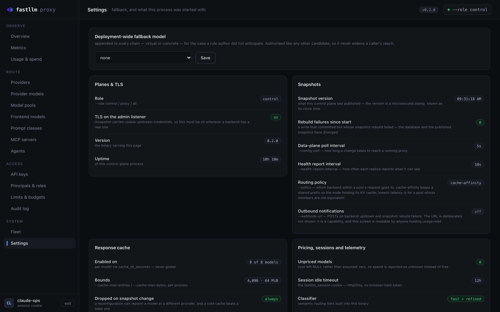

# A tour of the UI

Thirteen screens, embedded in the binary. What each one answers, and the one
thing on it worth knowing before you trust it.

## Overview — is it healthy, and what has it been doing

The four tiles are measured live by the page. The chart underneath is read
from the database, so it survives a reload and answers "was it like this an
hour ago" — a question the tiles cannot.

**Backends** is per replica and never merged. If one replica reports a backend
down and the others do not, that is a partition rather than a dead backend, and
averaging them together would delete the only symptom.

Click the chart for the drill-down:

Five ranges, pan backwards through history, filter by model or principal.
Requests are stacked as served / upstream errors / refusals-by-kind, because a
caller stopped by a budget and a backend that fell over need different people
to do different things. A gap in the latency line is a bucket with nothing to
measure — not zero.

## Metrics — what is happening right now

Rates measured by the page since it loaded, scoped to the fleet or to one
replica. Percentiles are shown per replica and never merged: the average of
four p99s is not a p99, and the screen says so rather than quietly averaging.

## Usage & spend — who used what, and what it cost

Folded from `usage_events`, one row per request. A model with no price
contributes nothing to spend and is counted as *unpriced* rather than as zero,
so a spend figure never quietly understates.

## Virtual models — one name, many targets

A client-facing name with ordered rules. The first rule whose conditions match
wins; targets are weighted *and* ordered, so one rule is both a split and a
failover chain. Conditions can be principal, role, prompt size, requested
generation, streaming, headers, budget consumption, time of day, or semantic
class.

**Dry-run** answers which rule would decide, and what the chain resolves to,
without dispatching anything.

## Prompt classes — routing on what the prompt is about

A class is a name plus example prompts; there is no training step. **Run
evaluation** scores every example against centroids that exclude it, so the
precision and recall it reports are not inflated by the example being inside
its own centroid.

## Principals & roles — who may invoke what

Roles carry permissions; principals hold roles. The matrix is the clearest
single picture of it — click a cell to grant or revoke. **Model grants** is the
same idea for `model:invoke`, per model.

A grant on a virtual model does **not** unlock the concrete models behind it.
Failover can never widen a caller's reach.

## Limits & budgets — caps that are enforced without a database call

Rate limits are per minute, budgets are per window. Both are resolved into the
snapshot, so enforcing them costs an integer comparison on the request path
rather than a query. A request that pushes a principal over budget completes;
the *next* one is refused with **402**, not 429 — waiting does not help until
the window rolls over.

## Fleet — what each replica can see

Per replica, deliberately unmerged. A replica on an older snapshot answers
`/health` with `ok` and misbehaves only on whatever changed — most often a key
it has never seen — so the snapshot version per replica is the thing to look at
when one replica behaves differently from the others.

## Audit log — every change, and who made it

Append-only, newest first, filterable by actor or target. Reads are not
recorded and neither are rejected attempts — it answers "what changed", not
"who looked".

## Settings — what this process was started with

The flags this process is running with, the fallback model, and two actions
worth being deliberate about: forcing a snapshot rebuild, and revoking every
session including your own.

## Where next

| | |
|---|---|
| [Connecting a client](integrations.md) | SDKs, coding agents, frameworks, observability |
| [Troubleshooting](troubleshooting.md) | The failures people actually hit |
| [Operations](operations.md) | The three roles, deployment shapes, configuration |
| [API and administration](api.md) | Every endpoint, and `openapi.json` |
